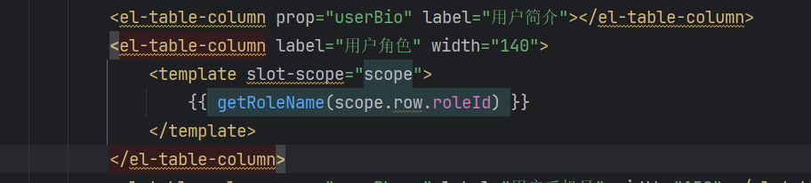
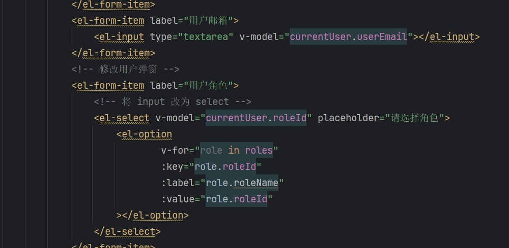
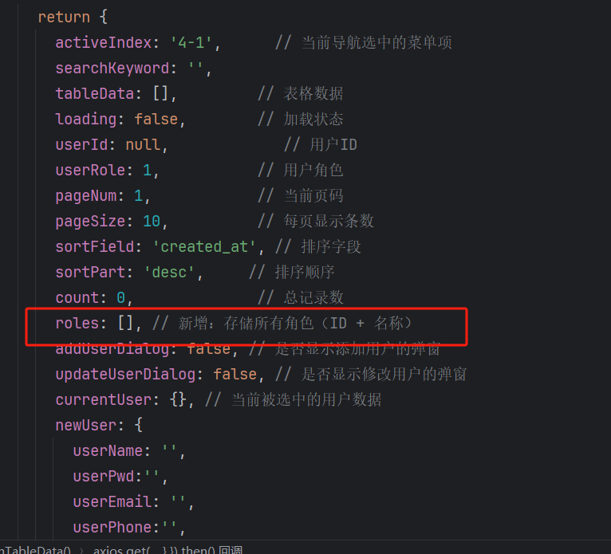
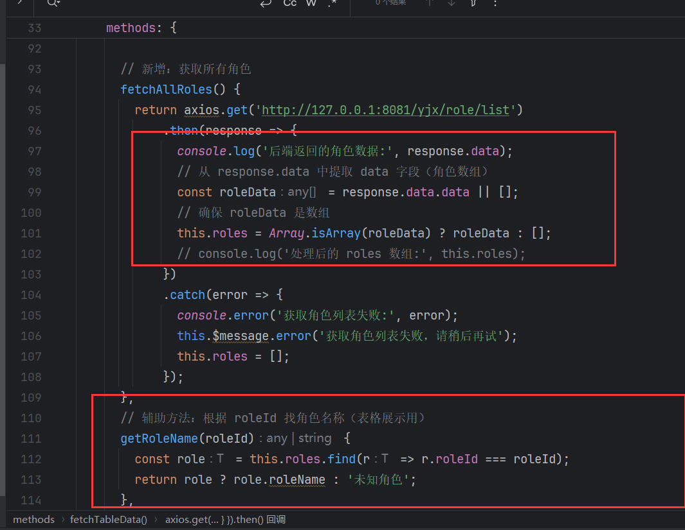

## 用户模块

按照我们前面讲的每一个新的模块需要构建的类

实体类--- 用户实体类


Controller层--UserController


Service层接口及实现类--UserService UserServiceImpl


Mapper层--- UsersMapper


工具类-- 接受分页参数的PageQuery


想想场景，用户登录进来后，是不是就需要查到列表，所以我们后端要先获取所有的内容

我们在查看前端需要哪些字段

#### **创建实体类**

```java
@Data  // 自动生成getter和setter方法
@TableName(value = "yjx_user")  // 指定数据库表名
@Builder  // 构造器
@AllArgsConstructor  // 全参构造函数
@NoArgsConstructor  // 无参构造函数
public class User implements Serializable {
    private Integer userId;
    private String userName;
    private String userEmail;
    private String userPasswordHash;
    private Integer roleId;
    private String userBio;
    private String userPhone;
    private String userGender;
    private LocalDateTime userLastActive;
    private LocalDateTime userCreatedAt;
    private String userStatus;
```


### 用户模块的查询（分页查询、多条件查询）

写代码之前 我们先想想我们有什么内容需要处理

主线其实大差不差是什么呢--获取前端传来的用户ID，角色，关键词，页码，排序，然后对各个参数做校验（哪些能够为空，哪些要设置默认值），然后调用SQL语句（查询相关的内容）

具体实现

​	Controller获取参数

​	service层首先处理分页，处理搜索，处理排序参数，调用mapper，封装响应数据，返回

​	Mapper层负责查询数据库，而查询数据库用SQL语句就可以实现权限过滤

##### 创建UserController

```java
    /**
     * 查询所有用户
     */
    @GetMapping("/getAllUsers")
    public Result<Map<String, Object>> getAllUsers(
            // 前端传递的参数（与你之前的 getAllRepair 接口参数一致）
            @RequestParam(value = "userId",required = false) Integer userId,
            @RequestParam(value = "searchKeyword", required = false) String searchKeyword,
            @RequestParam(value = "pageNum", required = false) Integer pageNum,
            @RequestParam(value = "pageSize", required = false) Integer pageSize,
            @RequestParam(value = "sortField", required = false) String sortField,
            @RequestParam(value = "sortOrder", required = false) String sortOrder)
    {
        Map<String, Object> data = userService.getAllUsers(userId, searchKeyword, pageNum, pageSize, sortField, sortOrder);
        return Result.success(data);  // 响应格式：{code:200, msg:"success", data:{...}}

    }
```


##### 创建Userservice接口

```java
    //查询所有用户
    Map<String, Object> getAllUsers(Integer userId, String searchKeyword, Integer pageNum, Integer pageSize, String sortField, String sortOrder);
```


##### 创建UserviceImpl实现类

依次处理分页，查询，排序，然后封装响应数据

```java
   //查询所有用户
   //分页查询
   @Override
   public Map<String, Object> getAllUsers(Integer userId, String searchKeyword, Integer pageNum, Integer pageSize, String sortField, String sortOrder) {
      // 1. 参数校验与默认值设置（避免null异常）
      pageNum = (pageNum == null || pageNum < 1) ? 1 : pageNum;
      pageSize = (pageSize == null || pageSize < 1) ? 10 : pageSize;
      searchKeyword = (searchKeyword == null) ? "" : searchKeyword.trim();
      // 默认排序：按创建时间降序
      if (sortField == null || sortField.trim().isEmpty()) {
         sortField = "createdAt";
      }
      if (sortOrder == null || (!"asc".equalsIgnoreCase(sortOrder) && !"desc".equalsIgnoreCase(sortOrder))) {
         sortOrder = "desc";
      }

      // 2. 分页查询
      Page<User> page = new Page<>(pageNum, pageSize);
      IPage<User> userIPage = userMapper.selectAllUser(page, userId, searchKeyword, sortField, sortOrder);

      // 3. 封装响应格式（与你之前的 getAllRepair 一致，前端可复用逻辑）
      Map<String, Object> responseMap = new HashMap<>();
      responseMap.put("userList", userIPage.getRecords());  // 维修管理列表
      responseMap.put("count", userIPage.getTotal());                  // 总条数（用于分页组件）
      return responseMap;
   }
```

##### 创建UserMapper

```java
//查询所有用户
    @Select("""
    SELECT 
        user_id AS userId,
        user_name AS userName,
        user_email AS userEmail,
        user_password_hash AS userPasswordHash,
        role_id AS roleId,
        user_bio AS userBio,
        user_phone AS userPhone,
        user_gender AS userGender,
        user_last_active AS userLastActive,
        user_created_at AS userCreatedAt,
        user_status AS userStatus
    FROM yjx_user
    WHERE 1=1
    -- 用户ID筛选：仅当userId不为null时添加条件
    AND ( #{userId} IS NULL OR user_id = #{userId} )
    -- 关键词搜索：仅当searchKeyword不为空时添加模糊匹配条件
    AND ( 
        #{searchKeyword} IS NULL OR #{searchKeyword} = '' OR
        user_name LIKE CONCAT('%', #{searchKeyword}, '%') OR
        user_email LIKE CONCAT('%', #{searchKeyword}, '%') OR
        user_phone LIKE CONCAT('%', #{searchKeyword}, '%')
    )
    -- 排序：与维修管理查询逻辑完全一致
    ORDER BY 
        CASE WHEN #{sortField} IS NOT NULL AND #{sortField} != '' 
             THEN CASE #{sortField} 
                  WHEN 'userName' THEN user_name 
                  WHEN 'userCreatedAt' THEN user_created_at 
                  WHEN 'userLastActive' THEN user_last_active 
                  WHEN 'userStatus' THEN user_status 
                  ELSE user_created_at END 
        ELSE user_created_at END 
        ${sortOrder != null && 'asc'.equals(sortOrder.toLowerCase()) ? 'ASC' : 'DESC'}
""")
    IPage<User> selectAllUser(Page<User> page, Integer userId, String searchKeyword, String sortField, String sortOrder);
```


### 查询所有角色(为了显示角色名称，提高用户体验)

#### 创建实体类

```java
package com.yjx.pojo;

import com.baomidou.mybatisplus.annotation.TableName;
import lombok.AllArgsConstructor;
import lombok.Builder;
import lombok.Data;
import lombok.NoArgsConstructor;

@Data
@TableName(value = "yjx_role")  // 指定数据库表名
@Builder  // 构造器
@AllArgsConstructor  // 全参构造函数
@NoArgsConstructor  // 无参构造函数
public class Role {
    private Integer roleId;
    private String roleName;
    private String roleDescription;
}
```


#### 创建Controller

```java
package com.yjx.controller;

import com.yjx.pojo.Role;
import com.yjx.service.RoleService;
import com.yjx.util.Result;
import org.springframework.beans.factory.annotation.Autowired;
import org.springframework.web.bind.annotation.GetMapping;
import org.springframework.web.bind.annotation.RequestMapping;
import org.springframework.web.bind.annotation.RestController;

import java.util.List;

@RestController
@RequestMapping("/role")
public class RoleController {
    @Autowired
    private RoleService roleService;

    @GetMapping("/list")
    public Result<List<Role>> listAllRoles() {
        return roleService.listAllRoles();
    }

}
```


#### 创建Service接口

```java
package com.yjx.service;

import com.yjx.pojo.Role;
import com.yjx.util.Result;

import java.util.List;

public interface RoleService {
    // 查询所有角色
    Result<List<Role>> listAllRoles();

}
```


#### 创建Service层实现类

```java
package com.yjx.service.impl;

import com.yjx.mapper.RoleMapper;
import com.yjx.pojo.Role;
import com.yjx.service.RoleService;
import com.yjx.util.Result;
import org.springframework.beans.factory.annotation.Autowired;
import org.springframework.stereotype.Service;

import java.util.List;

@Service
public class RoleServiceImpl implements RoleService {
    @Autowired
    private RoleMapper roleMapper;

    @Override
    public Result<List<Role>> listAllRoles() {
        List<Role> Roles = roleMapper.listAllRoles();
        return Result.success(Roles);

    }
}
```


#### 创建mapper层

```java
package com.yjx.mapper;

import com.yjx.pojo.Role;
import org.apache.ibatis.annotations.Select;

import java.util.List;

public interface RoleMapper {
    //查询所有角色
    @Select("SELECT * FROM yjx_role")
    List<Role> listAllRoles();
}
```


#### 前端使用的位置










### 用户模块的增加

调用注册用户的后端接口，前端可以去掉手机号这个输入框（添加弹出层还有参数列表）


### 用户模块的修改

##### 创建UserController

```java
    //修改用户
    @PostMapping("/updateUser")
    public Result<String> updateUser(@RequestBody User user) {
        return userService.updateUser(user);
    }
```

##### 创建Userservice接口

```java
    //更新用户
    Result<String> updateUser(User user);
```

##### 创建UserviceImpl实现类

```java
   //更新用户
   @Override
   @Transactional(propagation = Propagation.REQUIRED)
   public Result<String> updateUser(User user) {
      // 参数校验，确保userId存在
      if (user.getUserId() == null) {
         return Result.fail("用户ID不能为空",404);
      }
      // 执行更新操作，MyBatis - Plus的updateById方法会根据主键更新实体类中非null的字段
      int result = userMapper.updateUser(user);
      if (result > 0) {
         return Result.success("用户更新成功");
      } else {
         return Result.fail("用户更新失败，可能用户不存在",404);
      }
   }
```

##### 创建UserMapper

```java
    //更新用户
    @Update("UPDATE yjx_user " +
            "SET user_name = #{userName}, " +
            "user_email = #{userEmail}, " +
            "role_id = #{roleId}, " +
            "user_bio = #{userBio}, " +
            "user_phone = #{userPhone} " +
            "WHERE user_id = #{userId}")
    int updateUser(User user);
```


### 用户模块的删除

#### 


##### 创建UserController

```java
    //删除用户
    @DeleteMapping("/delete/{userId}")
    public Result<?> delete(@PathVariable Integer userId) {
        int result = userService.deleteUserByUserId(userId);
        if (result > 0) {
            return Result.success("删除成功");
        } else {
            return Result.fail("删除失败，配件不存在",404);
        }
    }
```


##### 创建Userservice接口

```java
    //删除用户
    int deleteUserByUserId(Integer userId);
```


##### 创建UserviceImpl实现类

```java
   //删除用户
   @Override
   @Transactional(propagation = Propagation.REQUIRED)
   public int deleteUserByUserId(Integer userId) {
      if(userId == null) {
         Result.fail("用户Id不能为空",404);
      }
      User user = userMapper.getById(userId);
      if(user == null) {
         Result.fail("用户记录不存在",404);
      }
      int rows = userMapper.deleteUserByUserId(userId);
      if(rows <= 0) {
         Result.fail("删除失败",404);
      }
      return rows;
   }
}
```

##### 创建UserMapper

```java
//用户根据用户id查询用户对象已经写了,大家可以跟自己情况修改名字
//删除用户
@Delete("delete from yjx_user where user_id =#{userId}")
int deleteUserByUserId(Integer userId);
```


#### 

