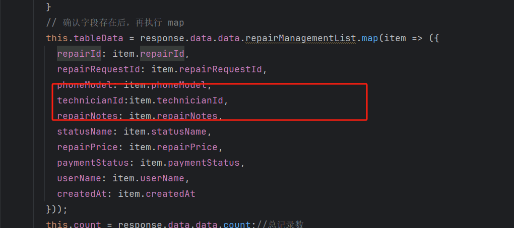

接下来做维修管理

同之前所讲，新建一个模块时，首先要新建各个模块的类


#### 维修管理的实体类(修改字段类型）

```java
package com.yjx.pojo;

import com.baomidou.mybatisplus.annotation.TableField;
import com.baomidou.mybatisplus.annotation.TableName;
import lombok.AllArgsConstructor;
import lombok.Builder;
import lombok.Data;
import lombok.NoArgsConstructor;

import java.time.LocalDateTime;
@Data
@TableName(value = "yjx_repair_management")  // 指定数据库表名
@Builder  // 构造器
@AllArgsConstructor  // 全参构造函数
@NoArgsConstructor  // 无参构造函数
public class Management {
    private Integer repairId; //维修id
    private Integer repairRequestId; //订单id
    private Integer technicianId; //维修人员id
    private Double repairPrice; //维修价格
    private String paymentStatus;//支付状态
    private String repairNotes; //维修备注
    private LocalDateTime createdAt; //创建时间
    private LocalDateTime updatedAt; //更新时间

    // 2. 新增非数据库字段（从关联表获取，前端必需）
    @TableField(exist = false)  // 标记：该字段不在 yjx_repair_management 表中
    private String phoneModel;  // 手机型号（来自 yjx_repair_request.phone_model）

    @TableField(exist = false)
    private String statusName;  // 维修状态名称（来自 yjx_repair_request.request_status，转文字）

    @TableField(exist = false)
    private String userName;    // 订单用户名（来自 yjx_user.user_name
}

```

### 实现维修管理的查询

#### 创建Controller类

```java
package com.yjx.controller;

import com.yjx.service.ManagementService;
import com.yjx.util.Result;
import org.springframework.beans.factory.annotation.Autowired;
import org.springframework.web.bind.annotation.GetMapping;
import org.springframework.web.bind.annotation.RequestMapping;
import org.springframework.web.bind.annotation.RequestParam;
import org.springframework.web.bind.annotation.RestController;

import java.util.Map;

@RestController
@RequestMapping("/management")
public class ManagementController {

    @Autowired
    private ManagementService managementService;

    @GetMapping("/getAllRepairManagement")
    public Result<Map<String, Object>> getAllRepairManagement(
            // 前端传递的参数（与你之前的 getAllRepair 接口参数一致）
            @RequestParam("userId") Integer userId,
            @RequestParam(value = "searchKeyword", required = false) String searchKeyword,
            @RequestParam(value = "pageNum", required = false) Integer pageNum,
            @RequestParam(value = "pageSize", required = false) Integer pageSize,
            @RequestParam(value = "sortField", required = false) String sortField,
            @RequestParam(value = "sortOrder", required = false) String sortOrder)
    {
        Map<String, Object> data = managementService.getAllRepairManagement(userId, searchKeyword, pageNum, pageSize, sortField, sortOrder);
        return Result.success(data);  // 响应格式：{code:200, msg:"success", data:{...}}

    }
}
```


#### 创建service层接口

```java
package com.yjx.service;

import com.baomidou.mybatisplus.extension.service.IService;
import com.yjx.pojo.Management;

import java.util.Map;

public interface ManagementService extends IService<Management> {
    //查询所以维修记录
    Map<String, Object> getAllRepairManagement(Integer userId, String searchKeyword, Integer pageNum, Integer pageSize, String sortField, String sortOrder);

}
```


#### 创建service层实现类

```java
package com.yjx.service.impl;

import com.baomidou.mybatisplus.core.metadata.IPage;
import com.baomidou.mybatisplus.extension.plugins.pagination.Page;
import com.baomidou.mybatisplus.extension.service.impl.ServiceImpl;
import com.yjx.mapper.ManagementMapper;

import com.yjx.pojo.Management;
import com.yjx.service.ManagementService;
import org.springframework.beans.factory.annotation.Autowired;
import org.springframework.stereotype.Service;
import java.util.HashMap;
import java.util.Map;

@Service
public class ManagementServiceImpl extends ServiceImpl<ManagementMapper, Management> implements ManagementService {
    @Autowired
    private ManagementMapper managementMapper;
    /**
     * 获取维修管理列表（支持分页、搜索、排序、权限过滤）
     *
     * @param userId        当前登录用户ID
     * @param searchKeyword 搜索关键词
     * @param pageNum       页码
     * @param pageSize      每页条数
     * @param sortField     排序字段
     * @param sortOrder     排序方向
     * @return 响应结果（包含列表和总条数，适配前端格式）
     */
    public Map<String, Object> getAllRepairManagement(
            Integer userId,
            String searchKeyword,
            Integer pageNum,
            Integer pageSize,
            String sortField,
            String sortOrder) {
        // 1. 参数校验与默认值设置（避免null异常）
        pageNum = (pageNum == null || pageNum < 1) ? 1 : pageNum;
        pageSize = (pageSize == null || pageSize < 1) ? 10 : pageSize;
        searchKeyword = (searchKeyword == null) ? "" : searchKeyword.trim();
        // 默认排序：按创建时间降序
        if (sortField == null || sortField.trim().isEmpty()) {
            sortField = "createdAt";
        }
        if (sortOrder == null || (!"asc".equalsIgnoreCase(sortOrder) && !"desc".equalsIgnoreCase(sortOrder))) {
            sortOrder = "desc";
        }

        // 2. 分页查询
        Page<Management> page = new Page<>(pageNum, pageSize);

        IPage<Management> managementPage = managementMapper.selectAllRepairManagement(
                page, userId, searchKeyword, sortField, sortOrder
        );

        // 3. 封装响应格式（与你之前的 getAllRepair 一致，前端可复用逻辑）
        Map<String, Object> responseMap = new HashMap<>();
        responseMap.put("repairManagementList", managementPage.getRecords());  // 维修管理列表
        responseMap.put("count", managementPage.getTotal());                  // 总条数（用于分页组件）
        return responseMap;
    }
}
```

#### 创建mapper层

```java
package com.yjx.mapper;

import com.baomidou.mybatisplus.core.mapper.BaseMapper;
import com.baomidou.mybatisplus.core.metadata.IPage;
import com.baomidou.mybatisplus.extension.plugins.pagination.Page;
import com.yjx.pojo.Management;
import org.apache.ibatis.annotations.Param;
import org.apache.ibatis.annotations.Select;

public interface ManagementMapper extends BaseMapper<Management> {

    /**
     * 分页查询维修管理列表（关联维修单表+用户表，获取前端所需所有字段）
     * @param page 分页对象（页码、每页条数）
     * @param userId 当前登录用户ID（用于权限过滤：如管理员查全部，普通用户查自己）
     * @param searchKeyword 搜索关键词（模糊匹配手机型号、维修描述、用户名）
     * @param sortField 排序字段（如 createdAt、repairId）
     * @param sortOrder 排序方向（asc/desc）
     * @return 分页结果（包含 Management 列表和总条数）
     */
    @Select("""
        SELECT 
            -- 1. 维修管理表（yjx_repair_management）字段
            rm.repair_id AS repairId,
            rm.repair_request_id AS repairRequestId,
            rm.technician_id AS technicianId,
            rm.repair_price AS repairPrice,
            rm.payment_status AS paymentStatus,
            rm.repair_notes AS repairNotes,
            rm.created_at AS createdAt,
            -- 2. 关联维修单表（yjx_repair_request）获取手机型号和维修状态
            rr.phone_model AS phoneModel,
            -- 维修状态转文字：根据实际枚举值调整（如 0=待维修，1=维修中，2=已完成）
            CASE rr.request_status 
                WHEN 0 THEN '待维修' 
                WHEN 1 THEN '维修中' 
                WHEN 2 THEN '已完成' 
                ELSE '未知状态' END AS statusName,
            -- 3. 关联用户表（yjx_user）获取订单用户名
            u.user_name AS userName
        FROM yjx_repair_management rm
        -- 第一次关联：维修管理表 → 维修单表（通过订单ID关联）
        LEFT JOIN yjx_repair_request rr 
            ON rm.repair_request_id = rr.request_id
        -- 第二次关联：维修单表 → 用户表（通过用户ID关联，获取用户名）
        LEFT JOIN yjx_user u 
            ON rr.user_id = u.user_id
        WHERE 1=1
        -- 权限过滤：与你之前的逻辑一致（userId=1/3查全部，其他查自己关联的）
        AND ( #{userId} IN (1,3) OR rm.technician_id = #{userId} )
        -- 搜索关键词：模糊匹配手机型号、维修描述、用户名（前端可能按这些字段搜索）
        AND ( 
            rr.phone_model LIKE CONCAT('%', #{searchKeyword}, '%') 
            OR rm.repair_notes LIKE CONCAT('%', #{searchKeyword}, '%') 
            OR u.user_name LIKE CONCAT('%', #{searchKeyword}, '%') 
        )
        -- 排序：与你之前的逻辑一致（支持按创建时间、维修ID排序）
        ORDER BY 
            CASE WHEN #{sortField} IS NOT NULL AND #{sortOrder} IS NOT NULL 
                 THEN CASE #{sortField} 
                      WHEN 'createdAt' THEN rm.created_at 
                      WHEN 'repairId' THEN rm.repair_id 
                      WHEN 'userName' THEN u.user_name 
                      ELSE rm.created_at END 
            ELSE rm.created_at END 
            ${sortOrder == 'desc' ? 'DESC' : 'ASC'}
    """)
    IPage<Management> selectAllRepairManagement(
            Page<Management> page,
            @Param("userId") Integer userId,
            @Param("searchKeyword") String searchKeyword,
            @Param("sortField") String sortField,
            @Param("sortOrder") String sortOrder
    );
}
```


### 前端文件修改 显示维修人员id


```html
<el-table-column prop="technicianId" label="维修人员id" width="100"></el-table-column>
```




```html
technicianId:item.technicianId,
```


```html
修改详情页面的维修id
<p>维修ID：${order.repairId}</p>
```

### 实现维修管理的增加

#### 创建增加的模型类

```java
package com.yjx.dto;

import lombok.Data;


@Data  // 仅用lombok的@Data生成getter/setter，无其他校验注解
public class ManagementCreateDTO {
    // 1. 订单ID：对应前端传递的 repairRequestId（关联 yjx_repair_request 表的 request_id）
    private Integer repairRequestId;

    // 2. 维修描述：对应前端传递的 repairNotes
    private String repairNotes;

    // 3. 维修人员ID：对应前端传递的 technicianId（即当前登录用户ID）
    private Integer technicianId;
}
```

#### 创建Controller类

```java
@PostMapping("/createRepairManagement")  // 请求方法、路径与前端对齐
public Result<Object> createRepairManagement(@RequestBody ManagementCreateDTO createDTO) {
    // 1. 手动参数非空校验（基础版DTO无注解，需手动判断）
    if (createDTO.getRepairRequestId() == null) {
        return Result.fail("订单ID不能为空", 400);  // 400=参数错误
    }
    if (createDTO.getRepairNotes() == null || createDTO.getRepairNotes().trim().isEmpty()) {
        return Result.fail("维修描述不能为空", 400);
    }
    if (createDTO.getTechnicianId() == null || createDTO.getTechnicianId().trim().isEmpty()) {
        return Result.fail("维修人员ID不能为空", 400);
    }

    // 2. 调用Service处理业务逻辑
    boolean isSuccess = managementService.createRepairManagement(createDTO);
    if (isSuccess) {
        return Result.success("维修记录创建成功");  // 成功响应（code=200，适配前端判断）
    } else {
        return Result.fail("新增失败：关联的订单ID不存在", 400);  // 业务错误（如订单ID无效）
    }
}
```

#### 创建service层接口

```java
boolean createRepairManagement(ManagementCreateDTO createDTO);
```

#### 创建service层实现类

```java
//增加维修管理记录
@Override
public boolean createRepairManagement(ManagementCreateDTO createDTO) {
    // 1. 校验：前端传递的 repairRequestId（订单ID）是否在维修单表中存在
    Integer requestId = createDTO.getRepairRequestId();
    // 调用RepairRequestMapper查询该订单ID的数量（1=存在，0=不存在）
    int orderCount = managementMapper.countByRequestId(requestId);
    if (orderCount == 0) {
        return false;  // 订单ID不存在，新增失败
    }

    // 2. DTO转实体：将前端参数映射到Management实体（补全默认值）
    Management management = new Management();
    management.setRepairRequestId(requestId);  // 订单ID（来自DTO）
    management.setRepairNotes(createDTO.getRepairNotes());  // 维修描述（来自DTO）
    management.setTechnicianId(createDTO.getTechnicianId());  // 维修人员ID（来自DTO，即当前用户）
    management.setRepairPrice("100.00");  // 默认价格（可根据业务调整，如从维修单表关联）
    management.setPaymentStatus("待支付");  // 默认支付状态（与前端表格展示选项一致）
    management.setCreatedAt(LocalDateTime.now());  // 创建时间（当前时间）
    management.setUpdatedAt(LocalDateTime.now());  // 更新时间（当前时间）

    // 3. 插入数据库（使用MyBatis-Plus的通用save方法，无需写SQL）
    return this.save(management);  // save成功返回true，失败返回false
}
```

#### 创建mapper层

```java
    @Select("SELECT COUNT(1) FROM yjx_repair_request WHERE request_id = #{requestId}")
    int countByRequestId(Integer requestId);
}
```

前端增加成功


### 实现维修管理的修改


#### 创建修改的模型类

​	

```java
package com.yjx.dto;

import lombok.Data;

@Data // Lombok自动生成getter/setter
public class ManagementUpdateDTO {
    // 订单ID：必填，且为正数（确保能定位到有效订单）
    private Integer repairId;
    // 维修价格：可选（允许不更新价格，前端不传则不更新）
    private Double repairPrice;
    // 支付状态：可选（必须是数据库enum义的有效值，如“待支付”“已支付”）
    private String paymentStatus;
    // 维修备注：可选（允许为空，但不能是纯空格）
    private String repairNotes;
    // 维修人员ID：必填（用于权限校验，确保是当前用户操作）
    private Integer technicianId;
}
```


#### 创建Controller类

```java
@PostMapping("/updateRepairManagement") // 与前端请求路径后缀一致
public Result<Object> updateRepairManagement(
        // 用@RequestBody接收前端JSON请求体（对应this.currentOrder）
        @RequestBody ManagementUpdateDTO updateDTO) {

    // 1. 手动基础参数校验（核心字段非空）
    // 校验订单ID：不能为空且必须为正数
    if (updateDTO.getRepairId() == null || updateDTO.getRepairId() <= 0) {
        return Result.fail("订单ID不能为空且必须为正数", 400); // 400=参数错误
    }
    // 校验维修人员ID：维修人员ID不能为空且只能为1或4
    if (updateDTO.getTechnicianId() == null  || updateDTO.getTechnicianId() != 1 && updateDTO.getTechnicianId() != 4) {
        return Result.fail("维修人员ID不能为空且只能为1或4", 400);
    }
    // 校验维修价格：若传值，必须为正数（可选字段，不传则不校验）
    if (updateDTO.getRepairPrice() != null && updateDTO.getRepairPrice() <= 0) {
        return Result.fail("维修价格必须为正数", 400);
    }
    // 校验维修备注：若传值，不能是纯空格（可选字段，不传则不校验）
    if (StringUtils.hasText(updateDTO.getRepairNotes())) {
        String trimNotes = updateDTO.getRepairNotes().trim();
        if (trimNotes.isEmpty()) {
            return Result.fail("维修备注不能是纯空格", 400);
        }
        // 修复备注：去除前后空格后重新赋值（避免存无效空格）
        updateDTO.setRepairNotes(trimNotes);
    }

    // 2. 调用Service层执行更新逻辑
    String resultMsg = managementService.updateRepairManagement(updateDTO);
    // 根据Service返回结果，返回对应响应
    if ("success".equals(resultMsg)) {
        return Result.success("订单修改成功"); // 适配前端 code=200 判断
    } else {
        return Result.fail(resultMsg, 400); // 业务错误（如订单不存在、无权限）
    }
}
```

#### 创建service层接口

```java
    String updateRepairManagement(ManagementUpdateDTO updateDTO);
```

#### 创建service层实现类

```java
// 1. 数据库payment_status的enum有效值列表（必须与数据库定义完全一致！）
// 例如：数据库enum定义为('待支付','已支付','退款中')，则列表需对应
private static final List<String> VALID_PAYMENT_STATUS = Arrays.asList("待支付", "支付中", "支付完成", "支付异常");

@Override
public String updateRepairManagement(ManagementUpdateDTO updateDTO) {
    // 2. 校验1：要更新的订单是否存在（根据repairId查询）
    Integer repairId = updateDTO.getRepairId();
    Management existingOrder = managementMapper.selectById(repairId);
    if (existingOrder == null) {
        return "要更新的订单不存在"; // 返回错误信息，Controller会返回给前端
    }

    // 3. 校验2：当前用户（technicianId）是否有权更新该订单
    Integer currentUserId = updateDTO.getTechnicianId();
    // 3.1 先校验当前用户是否存在
    User currentUser = userMapper.getById(currentUserId);
    if (currentUser == null) {
        return "当前用户不存在";
    }

    // 4. 校验3：支付状态是否为有效值（若前端传递了该字段）
    String paymentStatus = updateDTO.getPaymentStatus();
    if (StringUtils.hasText(paymentStatus)) {
        if (!VALID_PAYMENT_STATUS.contains(paymentStatus)) {
            return "支付状态无效，仅支持：" + String.join("、", VALID_PAYMENT_STATUS);
        }
    }

    // 5. 构建更新对象：仅更新前端传递的非空字段（避免覆盖原有值）
    Management orderToUpdate = new Management();
    orderToUpdate.setRepairId(repairId); // 订单ID（必传，定位要更新的订单）
    // 5.1 维修价格：前端传了非空值才更新
    if (updateDTO.getRepairPrice() != null) {
        orderToUpdate.setRepairPrice(updateDTO.getRepairPrice());        orderToUpdate.setTechnicianId(updateDTO.getTechnicianId());

    }
    // 5.2 支付状态：前端传了非空值才更新
    if (StringUtils.hasText(paymentStatus)) {
        orderToUpdate.setPaymentStatus(paymentStatus);
    }
    // 5.3 维修备注：前端传了非空值才更新（Controller已处理纯空格问题）
    if (StringUtils.hasText(updateDTO.getRepairNotes())) {
        orderToUpdate.setRepairNotes(updateDTO.getRepairNotes());
    }
    // 6. 执行数据库更新（MyBatis-Plus通用方法，按ID更新非空字段）
    int updateCount = managementMapper.updateById(orderToUpdate);
    return updateCount > 0 ? "success" : "更新失败，请重试";
}
```

#### 创建mapper层

```java
//根据维修id查询维修记录
@Select("SELECT * FROM yjx_repair_management WHERE repair_id = #{repairId}")
Management selectById(Integer repairId);
```

```java
  //更新维修记录(支付价格,状态,维修备注,更新时间)
@Update("""
    UPDATE yjx_repair_management 
    SET 
        repair_price = #{repairPrice,jdbcType=DECIMAL},  -- 维修价格
        payment_status = #{paymentStatus,jdbcType=VARCHAR},  -- 支付状态
        repair_notes = #{repairNotes,jdbcType=VARCHAR},  -- 维修备注
        technician_id = #{technicianId,jdbcType=INTEGER},  -- 维修人员id
        updated_at = NOW()  -- 更新时间
    WHERE repair_id = #{repairId,jdbcType=INTEGER}  -- 按订单ID定位
""")
int updateById(Management management);  // 参数为Management实体，获取要更新的字段值
```


### 实现维修管理的删除


#### 创建Controller类

```java
/**
 * 删除维修管理订单
 * 前端请求路径：http://127.0.0.1:8081/repairManagement/deleteRepairManagement
 * 前端参数：通过 params 传递 repairManagementId、userId、userPasswd
 */
@PostMapping("/deleteRepairManagement")  // 与前端请求路径后缀一致
public Result<Object> deleteRepairManagement(
        // 接收前端 params 参数，required = true 表示必填
        @RequestParam(value = "repairId", required = true) Integer repairId,
        @RequestParam(value = "userId", required = true) Integer userId,
        @RequestParam(value = "userPasswd", required = true) String userPasswd) {

    System.out.println("删除维修管理订单："+repairId);
    System.out.println("----------------repairId: " + repairId);
    System.out.println("----------------userId: " + userId);
    System.out.println("----------------userPasswd: " + userPasswd);

    // 1. 基础参数校验（避免空值）
    if (repairId == null || repairId <= 0) {
        return Result.fail("维修订单ID无效", 400);  // 400=参数错误
    }
    if (userId == null || userId==0) {
        return Result.fail("用户ID不能为空", 400);
    }
    if (userPasswd == null || userPasswd.trim().isEmpty()) {
        return Result.fail("请输入密码进行二次验证", 400);
    }

    // 2. 调用Service层执行删除逻辑

    // 调用Service，返回删除结果（true=成功，false=失败/无权限/订单不存在）
    String resultMsg = managementService.deleteRepairManagement(repairId, userId, userPasswd);
    // 若返回"success"，表示删除成功；否则返回具体错误信息
    if ("success".equals(resultMsg)) {
        return Result.success( "订单删除成功");  // 适配前端 code=200 判断
    } else {
        return Result.fail(resultMsg, 400);  // 返回业务错误（如“无权限删除”）
    }

}
```

#### 创建service层接口

```java
String deleteRepairManagement(Integer repairId, Integer userId, String userPasswd);
```

#### 创建service层实现类

```java
@Override
public String deleteRepairManagement(Integer repairId, Integer userId, String userPasswd) {
    // 1. 校验要删除的订单是否存在
    Management management = managementMapper.selectById(repairId);
    if (management == null) {
        return "要删除的维修订单不存在";  // 返回错误信息，Controller会返回给前端
    }

    // 2. 校验用户密码是否正确（二次验证，假设数据库密码是MD5加密存储）
    User user = userMapper.getById(userId);  // 根据userId查询用户信息
    if (user == null) {
        return "当前用户不存在";
    }
    // 密码比对：前端传的明文密码 → MD5加密后，与数据库存储的加密密码对比
    String encryptedPasswd = Md5Password.generateMD5(userPasswd);
    if (!encryptedPasswd.equals(user.getUserPasswordHash())) {  // 假设User类的密码字段是userPasswd
        return "密码错误，无法删除";
    }

    // 4. 所有校验通过，执行数据库删除（根据ID删除）
    int deleteCount = managementMapper.deleteById(repairId);
    return deleteCount > 0 ? "success" : "删除失败，请重试";  // 返回结果给Controller
}
```

#### 创建mapper层

```java
// 手动为 deleteById 写 SQL
@Delete("DELETE FROM yjx_repair_management WHERE repair_id = #{repairId}")
int deleteById(Integer repairId);
```


