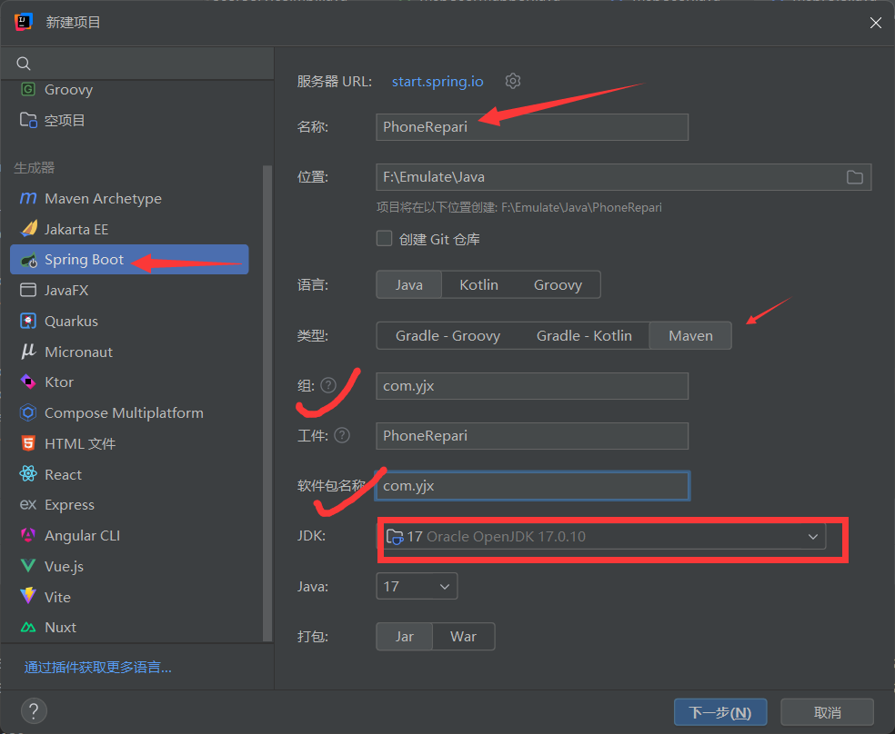

# 从零开始实现 SpringBoot+Vue 项目 —— 手机维修管理系统

## 一、学这个项目有什么用？

​	如果你未来走的是 Java 开发方向，前后端分离的项目（即 SpringBoot+Vue）是必会技能；即便不走 Java 开发路线，可以用于你们很多课程的课程设计（如数据库的，Java的，数据可视化的），学会这个项目（再拓展拓展）也能直接用于毕业设计。

​	SpringBoot+Vue 是 “前后端分离” 项目的典型组合，而前后端分离已是行业主流趋势，这对组合更是趋势下的 “最优解之一”。

​	下面给大家画张图，简单了解下我们各个技术之间的关系


### 1. 传统模式 vs 前后端分离模式

| 对比维度 | 传统模式（如 JSP+SSM）                                       | 前后端分离模式（SpringBoot+Vue）                             |
| -------- | ------------------------------------------------------------ | ------------------------------------------------------------ |
| 开发模式 | 前端代码嵌入后端模板，后端统一渲染页面后返回浏览器           | 前端（Vue）和后端（SpringBoot）完全独立： - 前端：负责页面展示、用户交互 - 后端：负责业务逻辑、数据处理 - 通过 **API 接口**（JSON 格式）通信 |
| 核心痛点 | - 职责混乱：前后端开发者需交叉懂对方技术 - 效率低下：代码耦合，改样式需后端重新部署 - 扩展性差：仅支持浏览器端 - 体验差：页面需整体刷新 | - 分工明确：前端专注 “好看好用”，后端专注 “稳定安全” - 效率翻倍：前后端可并行开发 - 多端复用：接口一次开发，支持网页 / 小程序 / APP - 体验流畅：页面局部刷新，类似手机 APP |

## 二、为什么选择 SpringBoot 和 Vue？

### 1. 后端核心：SpringBoot

SpringBoot 的核心价值是 **“让后端开发更简单、更高效”**，尤其适配前后端分离中的 “后端接口开发” 需求。

#### 解决传统后端的三大痛点：

- **无需堆砌配置，开箱即用**
  传统 SSM 需写大量 XML 配置（Spring 配置、数据库连接、MVC 映射等），新手易出错；而 SpringBoot 遵循 “**约定大于配置**”：
  - 引入依赖后，自动读取 `application.yml` 中的数据库配置；
  - 加 `@RestController` 注解即支持返回 JSON 接口；
  - 新手 1 小时即可搭好后端框架。
- **天生为接口服务设计**
  后端的核心是提供 API 接口，SpringBoot 简化接口开发：
  - `@GetMapping("/user")`：快速定义查询接口；
  - `@PostMapping("/user")`：快速定义新增接口；
  - 自动将 Java 对象转为 JSON 格式，前端可直接解析。
- **生态完善，一站式解决后端需求**
  无缝集成各类工具，覆盖后端全场景：
  - 数据库操作：集成 MyBatis/MyBatis-Plus；
  - 权限控制：集成 SpringSecurity/Shiro；
  - 接口文档：集成 Swagger；
  - 部署简单：一键打包成 Jar 包，无需复杂环境配置。

**一句话总结**：SpringBoot 是 “后端脚手架”—— 快速搭框架、专注写业务、零配置烦恼。

### 2. 前端核心：Vue

Vue 的核心价值是 **“让前端开发更简单、更灵活”**，专注解决 “页面渲染与用户交互” 问题。

#### 前端开发的三大优势：

- **上手简单，新手友好**
  语法贴近 HTML/CSS/JS，学习成本低：
  - 数据展示：`<div>{{ username }}</div>` 直接渲染后端数据；
  - 交互逻辑：`<button @click="show = !show">` 实现点击事件，无需手动绑定事件监听。
- **数据驱动，告别手动操作 DOM**
  传统前端需手动用 `document.getElementById` 更新页面，繁琐且易出错；Vue 采用 “数据驱动”：
  - 数据变化时，页面自动更新；
  - 示例：修改 `this.user.name = "李四"`，页面立即同步显示，无需操作 DOM。
- **生态丰富，覆盖前端全场景**
  配套工具链解决各类前端需求：
  - 路由管理：Vue Router（控制页面跳转，如 `/user` 对应用户列表页）；
  - 状态管理：Vuex/Pinia（存储全局数据，如用户登录信息）；
  - 接口请求：Axios（发送请求、接收数据，替代原生 `XMLHttpRequest`）；
  - UI 组件：Element Plus/Vuetify（拖拽生成表格、表单，无需手写 CSS）。

**一句话总结**：Vue 是 “前端利器”—— 新手易上手、组件可复用、数据驱动省代码。

### 3. 形象比喻：用 “餐厅” 理解前后端分离

| 角色               | 传统开发模式                       | 前后端分离模式（SpringBoot+Vue）                      |
| ------------------ | ---------------------------------- | ----------------------------------------------------- |
| 后端（SpringBoot） | 厨师 + 服务员（既做饭又端盘子）    | 厨师（只负责做饭 / 处理业务，提供 “菜单”=API 接口）   |
| 前端（Vue）        | 无独立角色（前端代码嵌入后端模板） | 服务员（只负责端盘子 / 用户交互，按 “菜单” 对接厨师） |
| 用户体验           | 效率低、响应慢                     | 效率高、体验流畅，可快速扩展外卖业务（多端复用）      |

## 三、项目技术栈全解析

整套技术栈就像 “盖房子的工具包”，每个工具分工明确、协同工作：

- **地基**：MySQL（存数据）
- **骨架**：SpringBoot（统筹后端组件）
- **砌墙**：MyBatis/MyBatis-Plus（数据搬运）
- **装修**：Vue（页面展示与交互）

### 1. 后端技术详解（处理 “数据怎么存、怎么算”）

后端好比 “餐厅后厨”：接收前端请求、处理业务逻辑、操作数据库，最终返回结果。

#### （1）MySQL：数据仓库

- **官方定义**：关系型数据库管理系统，存储结构化数据。

- 大白话

  ：带分类功能的 “大文件夹”，按 “表格” 存储数据：

  - 用户表：存 ID、姓名、密码；
  - 维修订单表：存订单 ID、维修内容、创建时间；
  - 表格通过 “用户 ID” 关联，可快速查询 “某用户的所有订单”。

- **项目作用**：存储系统所有核心数据（用户、订单、维修人员等）。

#### （2）MyBatis：数据搬运工

- **官方定义**：Java 持久层框架，简化 JDBC 操作，实现对象与表映射。

- 大白话

  ：Java 与 MySQL 的 “翻译官 + 搬运工”：

  - 发送 SQL：后端写 SQL 查订单，MyBatis 传给 MySQL；
  - 数据转换：MySQL 返回表格数据，MyBatis 自动转为 Java 对象（如 `Repair` 类）。

- **项目作用**：实现 “数据库数据 → Java 对象” 的转换，供后端业务逻辑使用。

#### （3）MyBatis-Plus（MP）：强化版搬运工

- **官方定义**：MyBatis 的增强工具，简化 CRUD 操作。

- 大白话

  ：预制 SQL 的 “懒人工具”，减少重复代码：

  - 查数据：不用写 `SELECT * FROM repair WHERE id=10`，直接调用 `getById(10)`；
  - 分页查询：`new Page<>(pageNum, pageSize)` 自动生成分页 SQL，无需手动写 `LIMIT`。

- **项目作用**：简化分页、新增、删除等常用操作，少写 80% 重复 SQL。

#### （4）SpringBoot：后端大管家

- **官方定义**：基于 Spring 的快速开发框架，简化配置与初始化。

- 大白话

  ：协调所有后端工具的 “管理者”：

  - 一键启动：加 `@SpringBootApplication` 注解，运行 main 方法即可启动服务；
  - 连接工具：自动关联 MyBatis 与 MySQL，无需手动配置连接；
  - 处理请求：通过 `@GetMapping` 分发请求到对应方法（如 `getAllRepairManagement`）。

- **项目作用**：统筹后端所有组件（Service、Mapper、Controller），是后端的 “骨架”。

### 2. 前端技术详解（处理 “数据怎么展示、怎么交互”）

前端好比 “餐厅前厅”：用户通过页面操作，看不到后端逻辑，只需要 “好看、好⽤”。

#### Vue：前端装修工

- **官方定义**：渐进式 JavaScript 框架，构建用户界面，核心是组件化与数据驱动。

- 核心能力

  1. 组件化

     ：页面拆成 “小积木”，复用性强：

     - 示例：订单页的 “搜索框”“分页按钮”“表格” 都是独立组件，可在其他页面复用；

  2. **数据驱动**：后端返回数据后，Vue 自动渲染到页面，无需手动操作 DOM。

- **项目作用**：实现系统所有页面（登录页、订单列表、新增弹窗）及交互逻辑（查询、删除按钮）。

### 3. 技术栈协同流程（以 “查询维修订单” 为例）

1. **用户交互**：用户在 Vue 页面点击 “我的订单” 按钮；
2. **前端请求**：Vue 通过 Axios 发送请求 `http://xxx/management/getAllRepairManagement`，携带用户 ID；
3. **后端分发**：SpringBoot 通过 `@GetMapping` 找到 `getAllRepairManagement` 方法；
4. **业务处理**：Service 层调用 MyBatis-Plus 执行 SQL，查询 MySQL 中的订单数据；
5. **数据转换**：MyBatis-Plus 将 MySQL 表格数据转为 Java 对象；
6. **响应返回**：SpringBoot 封装数据为 `Result` 格式，返回给 Vue；
7. **页面渲染**：Vue 自动将数据渲染成表格，展示给用户。

## 四、后续说明

项目开发中会遇到更多细节知识点（如参数校验、异常处理、权限控制等），我们将在实战中逐一讲解。

## 五、项目环境搭建

在搭建过程中会遇到很多知识点，我不会照着官方文档念，而是结合我的实战经验解读，再对照文档验证我的观点，确保内容实用且准确。

### 1. 基础软件安装（前置准备）	

首先安装项目开发所需的基础工具，按以下顺序安装即可：

1. **MySQL 安装**：参考教程 [MySQL 9.0 软件安装包下载及安装教程！](https://mp.weixin.qq.com/s?__biz=MzkzMTA5NjM4NA==&mid=2247567833&idx=1&sn=77ecabafe42cbd4b9977b217451c2994&chksm=c39d8c1625dbd69ad30894707dedb438696d84a46bea101ff23db433088d253aef0c6001ef4e&mpshare=1&scene=23&srcid=0904jTlwXaMNTUYyEIJUoKVi&sharer_shareinfo=0a73b21383ccbe13cde1e2f0a2fc5606&sharer_shareinfo_first=0a73b21383ccbe13cde1e2f0a2fc5606#rd)
2. **Navicat 安装**（数据库可视化工具）：参考教程 [Navicat 安装教程](https://mp.weixin.qq.com/s?__biz=MzkzMTA5NjM4NA==&mid=2247575531&idx=3&sn=cfbf00b7e53eecc2c2ad6d24b2d5f019&chksm=c30e777c8cd6d6cad6f9499f7e894f6ca50118bdcdb71f6ff37d7970d3a67f0cd66bc3111301&mpshare=1&scene=23&srcid=0904IuvKYKnX5T5MjUfMBHX8&sharer_shareinfo=aba8897f3a3a2e5ce5eb435155a30039&sharer_shareinfo_first=aba8897f3a3a2e5ce5eb435155a30039#rd)
3. **Node.js 安装**（前端开发环境，用于 Vue 项目构建）
4. **JDK 安装**（推荐 JDK 17，后端 Java 开发基础）

### 2. 后端项目搭建（SpringBoot）

首先设置中文编码，搜索编码，修改三处编码


使用 IDEA 搭建 SpringBoot 项目，步骤如下：




#### 步骤 1：创建新项目

1. 打开 IDEA → 点击「文件」→「新建」→「项目」；
2. 左侧选择「Spring Initializr」（SpringBoot 初始化工具）；
3. 右侧配置项目基本信息：
   - **名称**：自定义（例：`PhoneRepair`）；
   - **位置**：建议放在非 C 盘（避免权限问题）；
   - **语言**：选择「Java」；
   - **类型**：选择「Maven」（项目构建工具）；
   - **组**：自定义（例：`com.yjx`）；
   - **工件**：默认与项目名称一致；
   - **软件包**：建议与「组」保持一致（例：`com.yjx`）；
   - **JDK**：选择「17」。

#### 步骤 2：理解 Maven（自动化构建工具）

在选择依赖前，先搞懂 Maven 是什么 —— 它是后端开发的 “Jar 包管家”，核心解决两个痛点：

- **手动管理 Jar 包的繁琐**：传统开发需自己下载 Spring、MyBatis 等 Jar 包，还要手动处理版本兼容问题（比如 A 依赖需要 B 1.0 版本，而 C 依赖需要 B 2.0 版本，手动处理极易冲突）；
- **构建流程不统一**：编译、打包、部署等步骤无标准，团队协作效率低。

Maven 通过「依赖坐标」自动从中央仓库下载 Jar 包，并管理依赖间的版本关系，开发者只需声明依赖，无需手动操作。

​	如果你不用Maven 进行构建，那么你就需要自己去官网上下载jar包，同时要自己选择jar包的版本，自己考虑各个版本之间的冲突关系，比如我们后面就会遇到jar包版本不兼容的问题

​	配置Maven


#### 步骤 3：选择核心依赖

在「Dependencies」页面勾选以下基础依赖（后续可按需添加），每个依赖的作用如下：

| 依赖名称          | 核心作用                                                     |
| ----------------- | ------------------------------------------------------------ |
| DevTools          | 热部署：修改代码后无需重启项目即可生效，提升开发效率，配置热部署还有三步：1设置中编译勾选自动构建项目 2高级设置中勾选allow选项 3浏览器中f12 network界面禁用缓存 |
| Lombok            | 简化代码：自动生成实体类的 Get/Set 方法、构造器、toString 等，减少冗余代码 |
| MySQL Driver      | MySQL 连接器：实现 SpringBoot 与 MySQL 数据库的连接          |
| MyBatis Framework | 持久层框架：简化 Java 操作数据库的流程（SQL 执行、结果映射） |
| Spring Web        | Web 开发基础：提供 HTTP 请求处理、URL 路由、参数绑定等核心能力 |

> 额外说明：Redis 依赖（本次项目暂不用，但可了解）
>
> - **Redis 是什么**：内存中的键值对数据库，属于非关系型数据库，主打高性能（数据存内存，比磁盘存储快 10 倍以上），常用于缓存、计数器等场景。
>
> - 关系型 vs 非关系型数据库
>
>   | 对比维度 | 关系型数据库（如 MySQL）           | 非关系型数据库（如 Redis）             |
>  | -------- | ---------------------------------- | -------------------------------------- |
>   | 存储方式 | 表格（行 / 列结构），有固定 schema | 键值对、哈希等，无固定结构             |
>   | 数据位置 | 磁盘（持久化能力强）               | 内存（高性能，断电易丢失）             |
>   | 事务支持 | 强事务（ACID 特性）                | 弱事务（强调最终一致性）               |
>   | 适用场景 | 持久化存储（如订单、用户数据）     | 缓存、临时数据（如热点商品、会话信息） |
>   
> - **Redis 持久化**：虽然数据存内存，但支持 RDB（快照）和 AOF（日志）两种持久化方案，定期将数据同步到磁盘，避免关机丢失。
>
> - 面试常考：缓存三大问题
>
>   1. **缓存击穿**：热门 key 突然过期，大量请求直达数据库 → 解决方案：热点 key 永不过期 + 互斥锁（保证单线程更新缓存）；
>  2. **缓存穿透**：请求的数据在缓存和数据库中都不存在，导致请求全部打向数据库 → 解决方案：布隆过滤器（过滤无效请求）+ 空值缓存（缓存不存在的 key，设置短过期时间）；
>   3. **缓存雪崩**：大量 key 集中过期，导致数据库压力骤增 → 解决方案：key 过期时间加随机值（避免同时过期）+ 双缓存（A 缓存过期后读 B 缓存，异步更新 A/B）。

#### 步骤 4：等待项目构建

勾选依赖后点击「Finish」，IDEA 会自动下载依赖并构建项目结构，首次构建可能需要几分钟（取决于网络速度）。


​	然后呢我们这个地方要导入一些依赖，因为在启动器中的依赖是不够的，这里我们不去找每个依赖的内容了，大家直接拷贝我的pom.xml的依赖即可

```xml
<dependencies>
    <dependency>
        <groupId>org.springframework.boot</groupId>
        <artifactId>spring-boot-starter-web</artifactId>
    </dependency>
    <dependency>
        <groupId>org.mybatis.spring.boot</groupId>
        <artifactId>mybatis-spring-boot-starter</artifactId>
        <version>3.0.5</version>
    </dependency>
    <dependency>
        <groupId>org.springframework.session</groupId>
        <artifactId>spring-session-data-redis</artifactId>
    </dependency>

    <dependency>
        <groupId>org.springframework.boot</groupId>
        <artifactId>spring-boot-devtools</artifactId>
        <scope>runtime</scope>
        <optional>true</optional>
    </dependency>
    <dependency>
        <groupId>com.mysql</groupId>
        <artifactId>mysql-connector-j</artifactId>
        <scope>runtime</scope>
    </dependency>
    <dependency>
        <groupId>org.projectlombok</groupId>
        <artifactId>lombok</artifactId>
        <optional>true</optional>
    </dependency>
    <dependency>
        <groupId>org.springframework.boot</groupId>
        <artifactId>spring-boot-starter-test</artifactId>
        <scope>test</scope>
    </dependency>


    <!-- MyBatis-Plus: 提供更强大和简化的 MyBatis 数据库操作支持 -->
    <dependency>
        <groupId>com.baomidou</groupId>
        <artifactId>mybatis-plus-boot-starter</artifactId>
        <version>3.5.5</version>
    </dependency>
    <!-- Spring Boot Test Starter: 提供对 Spring Boot 应用程序的测试支持 -->
    <dependency>
        <groupId>org.springframework.boot</groupId>
        <artifactId>spring-boot-starter-test</artifactId>
        <scope>test</scope>
    </dependency>
    <!-- MyBatis Spring Boot Test Starter: 用于测试 MyBatis 的功能 -->
    <dependency>
        <groupId>org.mybatis.spring.boot</groupId>
        <artifactId>mybatis-spring-boot-starter-test</artifactId>
        <version>3.0.3</version>
        <scope>test</scope>
    </dependency>
    <!-- PageHelper: MyBatis 的分页插件 -->
    <dependency>
        <groupId>com.github.pagehelper</groupId>
        <artifactId>pagehelper</artifactId>
        <version>4.1.3</version>
    </dependency>
    <!-- 2. 显式引入兼容的 JSQLParser 版本（覆盖低版本的 0.9.4） -->
    <dependency>
        <groupId>com.github.jsqlparser</groupId>
        <artifactId>jsqlparser</artifactId>
        <version>4.6</version> <!-- 与 MP 3.5.5 完美兼容 -->
    </dependency>
</dependencies>
```

#### 步骤 5：创建项目包结构（遵循 MVC 设计模式）


### 搭好了之后，我们先试试行不行环境测试---注：需要先执行第六步也可以加入


MVC 是软件设计的 “分工原则”—— 让每个类只做一件事，提升代码可维护性。在 `src/main/java/com/yjx` 下创建以下包：

1. **config**：配置包 → 存放跨域处理、分页插件等配置类；
2. **controller**：控制层 → 接收前端请求，调用 Service 层处理，返回响应；
3. **service**：服务层 → 实现核心业务逻辑（如权限判断、数据校验），调用 Mapper 层操作数据库；
4. **mapper**：映射层 → 定义数据库操作接口（与 MyBatis 关联，执行 SQL）；
5. **pojo**：实体层 → 存放与数据库表一一对应的实体类（字段名、类型与表一致）；
6. **util**：工具类 → 存放可复用的工具方法（如日期处理、加密解密）；
7. **module**：模型类 → 按需返回前端数据（不同于 pojo，可能只返回部分字段，如列表页无需返回密码）；
8. **handle**：异常处理包 → 统一处理项目中的异常（基于 AOP 实现，避免每个方法写 try-catch）。

> 补充：AOP 是什么？
> AOP（面向切面编程）的核心思想是 “在不修改原代码的情况下扩展功能”。比如异常处理，我们可以通过 AOP 拦截所有 Controller 方法，统一捕获异常并返回标准响应，无需在每个方法中重复写 try-catch。

#### 步骤 6：配置 application.yml（核心配置文件）

将默认的 `application.properties` 重命名为 `application.yml`（语法更简洁，层级更清晰），添加以下配置：

```yaml
spring:
  # 数据库连接配置
  datasource:
    driver-class-name: com.mysql.cj.jdbc.Driver  # MySQL 驱动（8.0+ 需加 cj）
    url: jdbc:mysql://localhost:3306/phone_repair?useUnicode=true&characterEncoding=utf8&serverTimezone=GMT%2B8&useSSL=false
    # 说明：url 中 phone_repair 是数据库名（后续需手动创建），GMT%2B8 表示北京时间
    username: root  # 你的 MySQL 用户名
    password: 123456  # 你的 MySQL 密码
  # DevTools 热部署配置
  devtools:
    restart:
      enabled: true  # 开启热部署
      additional-paths: src/main/java  # 监听 Java 代码变更

# 日志配置
logging:
  charset:
    console: UTF-8  # 控制台日志编码
  level:
    com.yjx.mapper: trace  # 打印 Mapper 层的 SQL 日志（方便调试）

# MyBatis 配置
mybatis:
  type-aliases-package: com.yjx.pojo  # 给 pojo 包下的类起别名（XML 中可直接用类名）

# 服务配置
server:
  port: 8081  # 项目启动端口（避免与其他服务冲突）
  servlet:
    context-path: /yjx  # 项目上下文路径（访问接口需加前缀，如 http://localhost:8081/yjx/xxx）
```

### 3. 数据库环境搭建（MySQL + Navicat）

在搭建数据库之前，我们先理解一下数据库的重要性：

​	在正式进入数据库搭建环节前，我们先花几分钟搞清楚一个核心问题：**数据库到底是什么？我们为什么非要花时间搭建它，而不是用 Excel 表格或者记事本存数据？** 把这个 “底层逻辑” 想透，后面不管是建表、写 SQL 还是调优，你都会更清楚 “每一步在为什么服务”。

​	简单说，数据库的核心作用，就是**解决 “数据存储与使用” 的所有痛点**—— 我们先回想下，没有数据库的时候，用普通文件存数据会遇到什么麻烦？
比如你做一个电商网站，要存商品信息（名字、价格、库存）：

- 用 Excel 存：存个几百条还行，一旦商品上万条，想查 “价格低于 100 的手机”，得手动筛选；一旦多人同时改（比如两个客服同时改库存），很容易改乱、改丢；
- 用记事本存：数据连个格式都没有，找一条数据得从头翻到尾，更别说统计 “本月销量 Top10” 了。

​	而数据库，本质就是一个 **“专业管数据的工具”**，它要解决的就是这 3 个核心问题，这也是它的核心意义：

### 1. 先解决 “数据怎么存才不乱”—— 规范存储，避免混乱

​	数据库会用 “结构化” 的方式存数据：比如商品表必须有 “商品 ID、名字、价格、库存” 这些固定字段，每一条商品就是一行数据，就像给所有数据建了一套 “统一的收纳规则”。
​	不像 Excel 可能有人加一列 “备注”、有人不加，也不像记事本随便写格式 —— 数据库里的每一条数据都按规矩来，后续不管谁看、谁用，都能快速看懂 “这列是啥、那条代表啥”，从根源避免数据格式混乱。

### 2. 再解决 “数据怎么用才高效”—— 快速查、方便算，支持多人协作

​	这是数据库最核心的价值，也是我们搭建它的关键原因：

- **查得快**：比如想从 10 万条商品里找 “上海仓库存大于 50 的连衣裙”，数据库用 “索引”（类似书的目录），几毫秒就能找到，换成 Excel 可能要等半天；
- **算得方便**：要统计 “本月各品类销量总和”，数据库一句 SQL 就能出结果，不用手动拉 Excel 公式、还怕拉错行；
- **多人安全用**：比如两个客服同时改同一商品的库存，数据库会 “排队” 处理（这叫 “事务”），避免出现 “两个人都改库存 100，最后变成 99 而不是 98” 的错误；甚至能控制 “谁能改数据、谁只能看数据”（这叫 “权限”），避免数据被误删。

### 3. 最后解决 “数据怎么存才安全”—— 防丢、防坏，长期可靠

​	数据是业务的 “命根子”：比如电商的订单数据、用户的支付记录，丢了就是大问题。
数据库天生就有 “数据安全” 能力：可以定时自动备份（比如每天凌晨备份，就算今天数据坏了，还能恢复到昨天的状态）；就算电脑断电、服务器故障，也有机制避免数据损坏（这叫 “数据恢复”）—— 这些都是 Excel、记事本完全做不到的。

​	总结下来，我们搭建数据库，不是为了 “多一个工具”，而是为了给后续的业务（不管是做网站、做 APP 还是做管理系统）打下一个 “靠谱的数据地基”：让数据存得规范、用得高效、丢不了也坏不了。搞懂这一点，后面我们搭表、设字段的时候，你就会更清楚 “为什么要这么设计”—— 因为每一步都在为 “更好地管数据” 服务。

​	也就是说 他就是个地基，地基的重要性不用我多说吧，数据库不建好，后期就会遇到各种各样的问题，而你又不舍得推到重来，最终问题积累积累，一直积累到解决不了的时候 ，你是没有办法才推到重建，那时就得处理好多好多细节

​	所以说数据库工程师的工资为什么高


​	使用 Navicat 连接 MySQL，创建项目所需的数据库和表：


#### 步骤 1：创建数据库

1. 打开 Navicat → 连接 MySQL（输入主机名 `localhost`、端口 `3306`、用户名 / 密码）；
2. 右键连接 → 新建数据库 → 数据库名 `phone_repair`（与 application.yml 中一致），字符集选择 `utf8mb4`，排序规则不选都行
3. 这个地方呢就不用大家创建了 我给大家准备好了我已经执行好的SQL，大家拿去直接运行就行，所以我这个地方就给大家讲解一下各个表的作用

#### 步骤 2：创建数据表（7 张核心表）

根据手机维修管理系统的业务需求，创建以下表结构（表间通过外键关联，保证数据一致性）：

| 表名                      | 核心作用                                     | 关键字段（含外键）                                           |
| ------------------------- | -------------------------------------------- | ------------------------------------------------------------ |
| `yjx_role`                | 角色表：存储用户角色（如管理员、维修员）     | `role_id`（主键）、`role_name`（角色名称）                   |
| `yjx_user`                | 用户表：存储所有用户信息                     | `user_id`（主键）、`role_id`（外键，关联角色表）、`username`、`password` |
| `yjx_repair_status`       | 维修状态表：存储订单状态（如待维修、已完成） | `status_id`（主键）、`status_name`（状态名称）               |
| `yjx_repair_request`      | 维修单表：存储用户提交的维修订单             | `request_id`（主键）、`user_id`（外键，提交用户）、`receptionist_id`（外键，接待员）、`request_status`（外键，关联状态表）、`phone_model`（手机型号） |
| `yjx_repair_management`   | 维修管理表：存储订单处理详情                 | `management_id`（主键）、`repair_request_id`（外键，关联维修单表）、`technician_id`（外键，维修员）、`repair_price`（维修价格） |
| `yjx_parts`               | 配件表：存储维修所需配件                     | `part_id`（主键）、`part_name`（配件名称）、`supplier_id`（外键，关联供应商用户） |
| `yjx_supplier_management` | 供应商管理表：存储配件供应记录               | `sm_id`（主键）、`supplier_id`（外键，供应商）、`part_id`（外键，配件）、`supply_quantity`（供应数量） |

### 4. 测试 SpringBoot 与数据库连接--新模块构建

​	因为做测试就已经涉及到MVC的思想了，所以在测试连接之前，我想先给大家讲讲我们每一个新模块的构建需要有哪几步--画图

	1. 首先就是数据库与我们javabean的实体类的构建，字段要一一对应
	1. 前面还介绍了一个模型类，就是在不需要返回全部字段的时候用的，那么模型类的构建就需要根据我们具体需要/前端传来的参数进行构建（这个相当于参数类，接收参数用的，后面我会讲 不用你要怎么写，用了方便在哪）
	1. 与模型类对应的Controller，Service，ServiceImpl，Mapper
	1. 如果碰到其他问题，就需要新增config或者Util之类的

接下来，先测试是否能正常连接数据库：

#### 步骤 1：创建 Mapper、Service 层代码

1. **pojo 层**：创建 `User` 类（与 `yjx_user` 表字段对应，使用 Lombok 简化代码）：

   ```java
   /**
    * 用户实体类
    */
   @Data  // 自动生成getter和setter方法
   @TableName(value = "yjx_user")  // 指定数据库表名
   @Builder  // 构造器
   @AllArgsConstructor  // 全参构造函数
   @NoArgsConstructor  // 无参构造函数
   public class User implements Serializable {
       private Integer userId;
       private String userName;
       private String userEmail;
       private String userPasswordHash;
       private String roleId;
       private String userBio;
       private String userPhone;
       private String userGender;
       private LocalDateTime userLastActive;
       private LocalDateTime userCreatedAt;
       private String userStatus;
   }
   ```

2. **mapper 层**：创建 `UserMapper` 接口，继承 MyBatis-Plus 的 `BaseMapper`（无需写 SQL，直接用现成方法）：

   java

   ```java
   package com.yjx.mapper;
   import com.baomidou.mybatisplus.core.mapper.BaseMapper;
   import com.yjx.pojo.User;
   public interface UserMapper extends BaseMapper<User> {
   }
   ```

3. **service 层**：

   - 接口：`UserService` 继承 MyBatis-Plus 的 `IService`；

   java

   ```java
   package com.yjx.service;
   import com.baomidou.mybatisplus.extension.service.IService;
   import com.yjx.pojo.User;
   public interface UserService extends IService<User> {
   }
   ```

   - 实现类：`UserServiceImpl` 继承 `ServiceImpl`，实现 `UserService`；

   java

   ```java
   package com.yjx.service.impl;
   import com.baomidou.mybatisplus.extension.service.impl.ServiceImpl;
   import com.yjx.mapper.UserMapper;
   import com.yjx.pojo.User;
   import com.yjx.service.UserService;
   import org.springframework.stereotype.Service;
   @Service
   public class UserServiceImpl extends ServiceImpl<UserMapper, User> implements UserService {
   }
   ```

#### 步骤 2：编写测试类

在 `src/test/java/com/yjx/PhoneRepairApplicationTests.java` 中添加测试方法：

java

```java
package com.yjx;

import com.yjx.pojo.User;
import com.yjx.service.UserService;
import org.junit.jupiter.api.Test;
import org.springframework.beans.factory.annotation.Autowired;
import org.springframework.boot.test.context.SpringBootTest;

import java.util.List;

@SpringBootTest
class PhoneRepairApplicationTests {

    /**
     * 做测试
     */
    @Autowired
    private UserService userService;
    @Test
    void testLink(){
        List<User> list = userService.list();
        for (User user : list) {
            System.out.println(user);
        }
    }

}
```

#### 步骤 3：执行测试

点击左边的小三角 方法 → 「Run」，若控制台打印出 `yjx_user` 表中的用户数据，则说明 SpringBoot 与 MySQL 连接成功！


### 5. 理解注解（后端开发的核心）

测试通过后，我们来解读代码中用到的注解 —— 它们是框架简化开发的 “核心密码”。

#### （1）注解是什么？

注解（Annotation）是一种 “代码标签”，本身不执行逻辑，但能提供**元数据（描述数据的数据）**，框架或工具通过读取元数据实现特定功能（如自动注入、路由映射）。

#### （2）注解的核心作用

1. **简化配置**：替代 XML 配置文件，将配置写在代码中。
   例：`@Service` 标记一个类为服务层组件，Spring 会自动将其纳入容器管理，无需在 XML 中配置 bean。
2. **编译期检查**：提前发现代码错误。
   例：`@Override` 标记方法重写父类方法，若方法名拼写错误，编译器会直接报错。
3. **运行时动态处理**：框架通过反射读取注解，自动执行逻辑。

然后简单说明一下各个注解的作用

 	1. @Date：// 自动生成getter和setter方法，相当于@Getter和@Setter
 	2. @TableName(value = "yjx_user")  // 指定数据库表名：这是MyBatis-plus的要求，在这里制定出对应的表名
 	3. @AllArgsConstructor  // 全参构造函数
 	 @NoArgsConstructor  // 无参构造函数：看名字也知道就是代替了构造器，有个小问题就是不能构造出指定数量的字段，故我们用到了module模型类解决这个问题
 	4. @Service：他其实就是@Component，将对象创建交给SpringMvc容器后面的@Controller，也是一样的，是他的子注解--本质就是为了区分一下component，避免所有的注解都是一个名字
 	5. @Test：单元测试用的，原先不是需要写Main方法才能运行起来吗，那么用这个注解就不用了
 	6. @Autowired：自动注入，这个就是加入该注解后底层会自动定义Setter方法，注入对象已有的方法，属性值。注入形式：先按照类型后按照名字从容器找匹配的对象注入，若有多个实现类，则需要用到@quality，指定需要的对象
 	7. 不太理解，没有关系，我给大家举个例子，奶茶--有珍珠奶茶，有水果茶，有芝士葡萄，那么我new一个对象 就是要买一杯奶茶，那我是买珍珠的还是水果的还是别的呢？这个时候就要自动注入，自动注入就告诉了new的那个对象我买的是珍珠/水果茶，而new对象的操作也是用前面的@Component自动完成的
 	8. 后面的注解我们碰到再说


## 六、实战开发：登录功能实现（前后端联动）

登录是项目的核心入口功能，我们按 “前端页面 → 后端接口 → 数据校验 → 跨域处理” 的流程逐步实现。

#### 搭建项目之前大家需要安装一个js，node.js

node.js是什么呢，node.js对Vue来说就像jdk对java，理解了吧

### 1. 前端登录页面搭建

首先新建一个空项目


​	左边选择空项目，右边选择存放路径，名称，我这里就取名手机维修前端了

​	由于我们聚焦 Java 后端开发，前端采用 “导入静态模板 + 简化开发” 的方式，核心关注与后端交互的逻辑。

​	再下载一个插件live-edit，然后执行命令npm install -g live-serve


安装完成后运行live-serve，看到如下页面，表示环境构建完成


​	然后我们是做Java的，前面也提到了这里是前后端分离的项目，前端应该是由前端工程师配合美工来做，我们这里就跳过了，只做简单的页面处理，所以我们先导入我们的静态资源

​	导入的资源就相当于我们在网上下的模板，我们只要会看得懂，明白它与后端的调度是怎样的即可

​	然后我们新建一个Page文件夹，再新建一个login页面


​	其实页面都没什么，重点在js文件里面，打开我们的login.js

​	先给大家解读一下比较重要的关键词的含义

| 关键语法                    | 含义与作用                                                   |
| --------------------------- | ------------------------------------------------------------ |
| `el: '#app'`                | 挂载点：指定 Vue 实例控制的 HTML 元素（这里是 id 为 `app` 的 div） |
| `data() { return { ... } }` | 数据存储：定义页面动态数据（如登录表单、验证码），支持双向绑定 |
| `mounted() { ... }`         | 生命周期钩子：页面加载完成后自动执行（如初始化验证码 `this.refreshCaptcha()`） |
| `methods: { ... }`          | 方法集合：封装交互逻辑（如登录、刷新验证码）                 |
| `async handleLogin()`       | 异步方法：配合 `await` 处理网络请求（避免回调嵌套）          |
| `axios`                     | 网络请求工具：发送 HTTP 请求到后端（如登录时传递账号密码）   |

#### 步骤 2：登录逻辑核心（login.js）

以下 JavaScript 代码示例展示了前端如何通过 `axios` 向后端发送登录请求，实现数据交互：

javascript

```javascript
axios.post('http://localhost:8081/yjx/user/login', {
  usernameOrEmail: 'xxx',
  password: 'xxx'
})
```

上述代码的核心作用是：

- 向指定后端接口 `http://localhost:8081/yjx/user/login` 发送 **POST 请求**

- 请求体中携带用户输入的「账号 / 邮箱」（`usernameOrEmail`）和「密码」（`password`）

- 等待后端验证请求数据后，接收并处理后端返回的结果（成功 / 失败）

  ## Vue 登录功能各部分关系总结

  Vue 项目中，登录功能的实现依赖于以下核心模块的配合，各模块职责与流程如下：

  1. **`el`**：确定 Vue 实例挂载的页面范围（即 Vue 控制的 DOM 区域），确保页面元素能被 Vue 响应式管理。
  2. **`data`**：存储页面所需的动态数据，例如用户输入的账号、密码、验证码，以及请求状态（如 “登录中” 标识）。
  3. **`mounted`**：Vue 生命周期钩子，页面加载完成后自动执行初始化操作（如生成并展示验证码）。
  4. **`methods`**：存放页面交互逻辑的方法集合，例如 `handleLogin`（登录方法）、`refreshCode`（刷新验证码方法）。
  5. **`async handleLogin`**：异步登录处理方法，核心逻辑是通过 `axios` 向后端发送登录请求，接收后端结果后执行后续操作（如页面跳转、错误提示）。

  #### 理论完毕，接下来我们要正式开始后端开发了

  我们想一想这个场景与思路：  

  1. 用户访问我们的页面，随便看了看，然后用户准备登录了  

  2. 登录需要用户输入账号，密码，验证码（验证码是前端完成的，我们不管）然后用户点击登录  接下来我们就要获取用户输入的账号和密码，拿去数据库里面做比对，看逻辑是否正确，如果正确是不是就可以跳转到首页，不正确就返回错误信息  

     所以整个主线就是----获取用户输入，判断账号密码是否正确，返回结果  

     主线是这样，那么代码如何实现     	

     5. 获取用户输入，Controller层就是负责接收参数的    	

        1. 判断逻辑，Service就是负责判断逻辑的，而在判断逻辑中又有细分       	首先判断账号是否存在，不存在直接返回        	
           	账号存在了，再判断密码是否正确，不正确直接返回        
     
           这两条都通过了，就代表登录成功    	

           ​	获取数据库的内容，mapper层就是负责干这个的     有了思路接下来我们进行代码实现

  

  ### 登录功能完整流程

  页面加载时生成验证码 → 用户输入账号、密码、验证码 → 点击 “登录” 按钮触发 `handleLogin` 方法 → 前端验证输入合法性（如验证码是否正确）→ 调用 `axios` 发送请求到后端 → 根据后端返回结果执行操作（成功则跳转首页，失败则提示错误信息）。

  ## 后端登录功能开发思路与实现步骤

  当前端登录功能准备完成后，需后端配合实现数据验证与逻辑处理。以下是后端开发的核心场景、思路与代码实现方向。

  ### 1. 核心场景与主线逻辑

  用户操作流程：访问页面 → 输入账号 / 密码 / 验证码 → 点击登录 → 等待登录结果
  后端主线逻辑：**接收用户输入 → 验证账号密码合法性 → 返回登录结果**
  
  ### 2. 后端分层开发思路（MVC 思想）
  
  后端采用「Controller → Service → Mapper」分层架构实现登录逻辑，各层职责明确，便于维护与扩展：

  | 层级       | 核心职责                              | 具体实现点                                                   |
  | ---------- | ------------------------------------- | ------------------------------------------------------------ |
  | Controller | 接收前端请求、参数校验、返回响应      | 1. 接收前端传递的 `usernameOrEmail` 和 `password` 2. 调用 Service 层方法 3. 封装并返回结果（成功 / 失败信息） |
  | Service    | 实现核心业务逻辑、数据校验            | 1. 判断账号（或邮箱）是否在数据库中存在 2. 若账号存在，校验密码是否正确 3. 返回逻辑判断结果（成功 / 失败原因） |
  | Mapper     | 与数据库交互，执行数据查询 / 修改操作 | 1. 根据 `usernameOrEmail` 查询数据库中的用户信息 2. 提供数据访问接口，供 Service 层调用 |
  
  ### 3. 代码实现步骤（按层级顺序）
  
  #### 步骤 1：Controller 层（接收请求与参数）

  - 定义登录接口（与前端 `axios` 请求的 URL 一致，如 `/yjx/user/login`）
- 使用 `@RequestBody` 接收前端传递的账号、密码参数
  - 调用 Service 层的登录验证方法，获取业务逻辑结果
  - 封装响应数据（如登录成功返回 Token，失败返回错误提示）并返回给前端
  
  #### 步骤 2：Service 层（实现业务逻辑）

  - 定义登录验证方法（如 `login(String usernameOrEmail, String password)`）
- 调用 Mapper 层方法，根据账号 / 邮箱查询用户信息：
    - 若查询结果为 `null`（账号不存在），直接返回 “账号不存在” 的错误信息
    - 若账号存在，对比数据库中存储的加密密码与前端传递的密码（需注意密码加密校验，如 BCrypt 加密）
    - 若密码不匹配，返回 “密码错误” 的错误信息；若匹配，返回 “登录成功” 及用户信息 / Token
    
  #### 步骤 3：Mapper 层（数据库交互）

  - 定义数据访问接口（如 `UserMapper`），提供根据账号 / 邮箱查询用户的方法（如 `selectByUsernameOrEmail(String usernameOrEmail)`）
- 通过 MyBatis 等 ORM 框架编写 SQL 语句，实现从数据库中查询用户信息的功能（查询条件为 `username` 或 `email`）

### 2. 后端登录接口实现

​	同我之前所讲的 开发一个新的模块需要建立的类，然后我们在测试数据库时就已经建好了，所以这里就不用再次创建了

​	前端发送请求后，后端需要按 “接收参数 → 业务校验 → 数据查询 → 返回结果” 的流程处理，遵循 “Controller → Service → Mapper” 的分层思想。

##### 	----注意---

​	这里是先创建Controller层，在考虑返回值的时候再创建Result，再创建Result<LoginUser>

#### 步骤 1：定义统一响应类（Result）

为了让前后端交互格式一致，创建 `util` 包下的 `Result` 类，统一封装响应数据：

java

```java
package com.yjx.util;

import lombok.Data;

@Data
public class Result<T> {
    private Integer code;       // 状态码（200=成功，404=失败等）
    private String msg;         // 提示信息
    private T data;             // 返回数据（如登录用户信息）
    private long timestamp;     // 请求时间戳（便于排查问题）

    // 成功响应：返回数据+默认成功信息
    public static <T> Result<T> success(T data) {
        Result<T> result = new Result<>();
        result.setCode(200);
        result.setMsg("操作成功");
        result.setData(data);
        result.setTimestamp(System.currentTimeMillis());
        return result;
    }

    // 失败响应：自定义错误信息+状态码
    public static <T> Result<T> fail(String msg, Integer code) {
        Result<T> result = new Result<>();
        result.setCode(code);
        result.setMsg(msg);
        result.setData(null);
        result.setTimestamp(System.currentTimeMillis());
        return result;
    }
}
```

#### 步骤 2：Controller 层（接收请求 + 返回响应）

创建 `UserController`，负责接收前端的登录请求，调用 Service 层处理，最后返回统一响应：

​	----创建时同步讲解@RestController，@RequestMapping

​	@RestController：用于简化@ResponseBody注解，避免重复写@ResponseBody，实质上@RestController=@Controller+@ResponseBody

​	@ResponseBody：替代了原生需要创建流，输出流，刷新，关闭的操作，直接用return即可输出，也就是说我们返回的一个JavaBean对象如何被浏览器解析呢？这里就是通过ResponseBody注解，Spring框架会自动帮我们把return的内容转换成json格式字符串供浏览器解析

​	@Controller：就是我们前面提到的@Component注解，他可以帮我解析浏览器的请求

​	@RequestMapping：路由，映射路径，也就是说用户点击某个地方后，js就会请求后台，而请求到哪就是根据这个，其实我们用户也可以用url访问吧，但是一般不会这样做

java

```java
package com.yjx.controller;

import com.yjx.pojo.LoginUser;
import com.yjx.service.UserService;
import com.yjx.util.Result;
import org.springframework.beans.factory.annotation.Autowired;
import org.springframework.web.bind.annotation.PostMapping;
import org.springframework.web.bind.annotation.RequestMapping;
import org.springframework.web.bind.annotation.RequestParam;
import org.springframework.web.bind.annotation.RestController;

@RestController // 标记为控制器，返回JSON数据
@RequestMapping("/user") // 接口前缀：/user
public class UserController {

    @Autowired // 自动注入UserService实例
    private UserService userService;

    /**
     * 登录接口：接收账号/邮箱和密码
     */
    @PostMapping("/login") // 处理POST请求：/user/login
    public Result<LoginUser> login(
            @RequestParam String usernameOrEmail, // 接收前端传入的账号/邮箱
            @RequestParam String password         // 接收前端传入的密码
    ) {
        // 调用Service层的登录逻辑
        LoginUser loginUser = userService.login(usernameOrEmail, password);
        // 根据结果返回响应
        if (loginUser == null) {
            return Result.fail("用户名或密码错误", 400); // 失败：状态码400
        }
        return Result.success(loginUser); // 成功：返回用户信息
    }
}
```

#### 步骤 3：Service 层（业务逻辑处理）

Service 层是登录功能的核心，负责校验 “账号是否存在”“密码是否正确”，分为接口和实现类：

##### （1）Service 接口（UserService.java）

```java
package com.yjx.service;

import com.baomidou.mybatisplus.extension.service.IService;
import com.yjx.pojo.LoginUser;
import com.yjx.pojo.User;

public interface UserService extends IService<User> {
    // 登录方法：接收账号/邮箱和密码，返回登录用户信息
    LoginUser login(String usernameOrEmail, String password);
}
```

##### （2）Service 实现类（UserServiceImpl.java）

java

```java
package com.yjx.service.impl;

import com.baomidou.mybatisplus.core.conditions.query.QueryWrapper;
import com.baomidou.mybatisplus.extension.service.impl.ServiceImpl;
import com.yjx.mapper.UserMapper;
import com.yjx.pojo.LoginUser;
import com.yjx.pojo.User;
import com.yjx.service.UserService;
import com.yjx.util.Md5Password;
import org.springframework.stereotype.Service;

@Service // 标记为服务层组件
public class UserServiceImpl extends ServiceImpl<UserMapper, User> implements UserService {

    @Override
    public LoginUser login(String usernameOrEmail, String password) {
        // 1. 根据账号或邮箱查询用户（MyBatis-Plus的条件构造器）
        QueryWrapper<User> queryWrapper = new QueryWrapper<>();
        queryWrapper.eq("user_name", usernameOrEmail) // 匹配用户名
                    .or() // 或
                    .eq("user_email", usernameOrEmail); // 匹配邮箱
        User user = this.getOne(queryWrapper); // 执行查询

        // 2. 校验用户是否存在
        if (user == null) {
            return null; // 用户名/邮箱不存在
        }

        // 3. 校验密码（MD5加密后比对，避免明文存储密码）
        String encryptedPassword = Md5Password.generateMD5(password);
        if (!encryptedPassword.equals(user.getUserPasswordHash())) {
            return null; // 密码错误
        }

        // 4. 封装登录用户信息（返回给前端，隐藏敏感字段如密码）
        LoginUser loginUser = new LoginUser();
        loginUser.setUserId(user.getUserId());
        loginUser.setUserName(user.getUserName());
        loginUser.setUserEmail(user.getUserEmail());
        loginUser.setRoleId(user.getRoleId()); // 角色ID（用于后续权限控制）
        loginUser.setUserPhone(user.getUserPhone());

        return loginUser; // 登录成功，返回用户信息
    }
}
```

#### 步骤 4：Mapper 层（数据库查询）

通过 MyBatis-Plus 的 `BaseMapper` 简化数据库操作，无需手动编写 SQL：

java

```java
package com.yjx.mapper;

import com.baomidou.mybatisplus.core.mapper.BaseMapper;
import com.yjx.pojo.User;
import org.apache.ibatis.annotations.Select;

public interface UserMapper extends BaseMapper<User> {
    // 如需自定义SQL，可在此添加（例：根据ID查询用户）
    @Select("SELECT * FROM yjx_user WHERE user_id = #{userId}")
    User selectById(Integer userId);
}
```

### 3. 关键功能补充：MD5 密码加密

为了安全，数据库中不能存储明文密码，需用 MD5 加密后存储。创建 `util` 包下的 `Md5Password` 工具类：

```java
package com.yjx.util;

import java.security.MessageDigest;
import java.security.NoSuchAlgorithmException;

public class Md5Password {
    /**
     * MD5加密方法
     */
    public static String generateMD5(String password) {
        try {
            // 1. 获取MD5加密实例
            MessageDigest md = MessageDigest.getInstance("MD5");
            // 2. 将密码转换为字节数组并加密
            byte[] encryptedBytes = md.digest(password.getBytes());
            // 3. 将加密后的字节数组转换为16进制字符串
            StringBuilder sb = new StringBuilder();
            for (byte b : encryptedBytes) {
                String hex = Integer.toHexString(0xff & b);
                if (hex.length() == 1) sb.append('0');
                sb.append(hex);
            }
            return sb.toString();
        } catch (NoSuchAlgorithmException e) {
            e.printStackTrace();
            return null;
        }
    }
}
```

### 然后就实现完成 我们做测试，运行发现报错信息一长串，其实他就是我们前面提到的跨域请求的问题

见到问题不要慌，Java行业发展这么久，你的问题早就被别人碰到过，解决了，我们拿去网上一搜就行了，然后把别人的解决方法复制进来看看行不行


[解决跨域问题的8种方法，含网关、Nginx和SpringBoot~-阿里云开发者社区](https://developer.aliyun.com/article/1427775)


### 4. 解决跨域问题

前端（如 `127.0.0.1:8080`）调用后端（`127.0.0.1:8081`）时，会因 “端口不同” 触发浏览器的跨域安全限制，需在后端配置跨域过滤器：

创建 `config` 包下的 `CorsConfig` 类：

java

```java
package com.yjx.config;

import org.springframework.context.annotation.Bean;
import org.springframework.context.annotation.Configuration;
import org.springframework.web.cors.CorsConfiguration;
import org.springframework.web.cors.UrlBasedCorsConfigurationSource;
import org.springframework.web.filter.CorsFilter;

@Configuration // 标记为配置类
public class CorsConfig {

    @Bean
    public CorsFilter corsFilter() {
        // 1. 配置跨域规则
        CorsConfiguration config = new CorsConfiguration();
        config.setAllowCredentials(true); // 允许携带Cookie
        config.addAllowedOriginPattern("http://127.0.0.1:8080"); // 允许前端域名（按需修改）
        config.addAllowedHeader("*"); // 允许所有请求头
        config.addAllowedMethod("*"); // 允许所有请求方法（GET/POST/PUT等）

        // 2. 应用跨域规则到所有接口
        UrlBasedCorsConfigurationSource source = new UrlBasedCorsConfigurationSource();
        source.registerCorsConfiguration("/**", config); // 匹配所有接口路径

        return new CorsFilter(source);
    }
}
```


### 于是乎我们的登录功能就完成了

登录是完成了那我们的注册呢

大家可以仿造我们登录自己写一下注册吗

不过我还是先给大家提供一下思路

Controller层接收参数，调用service的逻辑处理方法，然后这里用MyBatis-plus的save方法即可

那么接收参数就要用到我们的模型类那么就要建一个RegisterUser，在控制层接收参数

然后传给我们的service层，首先判断账号 用户名在数据库中是否存在，存在则直接返回fail，如果都不存在

则将密码加密，在把账号，用户名，密码和其他字段存入一个对象中，再调用save方法

RegisterUser模型类

```
@Data
public class RegisterUser {
    private String userName;       // 和前端传的 key 完全一致
    private String userEmail;      // 和前端传的 key 完全一致
    private String userPasswordHash; // 和前端传的 key 完全一致
}
```

Controller层

```
@PostMapping("/createUser")
public Result<String> register(@RequestBody RegisterUser registerUser) {
    // 调用 Service 时，从 DTO 中获取参数
    return userService.register(
            registerUser.getUserName(),
            registerUser.getUserEmail(),
            registerUser.getUserPasswordHash()
    );
}
```

Service

```
Result<String> register(String userName, String userEmail, String userPasswordHash);
```

ServiceImpl

```
@Override
public Result<String> register(String userName, String userEmail, String userPasswordHash) {
    //判断用户名是否已存在
    User user = this.getOne(new QueryWrapper<User>().eq("user_name", userName));
    if (user != null) {
        return Result.fail("用户名已存在", 400);
    }
    //判断邮箱是否已存在
    user = this.getOne(new QueryWrapper<User>().eq("user_email", userEmail));
    if (user != null) {
        return Result.fail("邮箱已存在", 400);
    }
    User newUser = new User();
    newUser.setUserName(userName);
    newUser.setUserEmail(userEmail);
    newUser.setUserPasswordHash(Md5Password.generateMD5(userPasswordHash));
    newUser.setRoleId("2");
    boolean save = this.save(newUser);

    return save ? Result.success("注册成功") : Result.fail("注册失败", 500);
}
```

### 于是乎我们的注册功能就完成了
