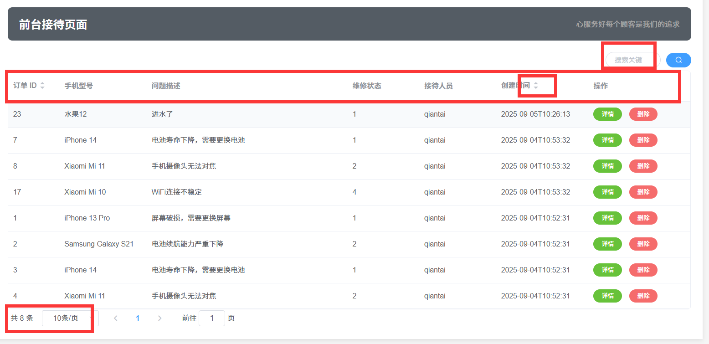
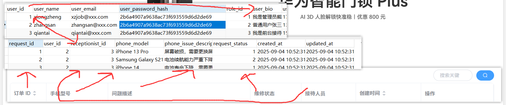

登录功能完成，下面做主页的内容

#### **主页**

按照我们前面讲的每一个新的模块需要构建的类

实体类，模型类，Controller层，Service，ServiceImpl，Mapper


观察js文件

想想场景，用户登录进来后，是不是就需要查到列表，所以我们后端要先获取所有的内容

我们在查看前端需要哪些字段

在与数据库做比对 发现和我们Repair不太一样 所以需要新建一个模型类


#### 创建模型类

```
package com.yjx.module;

import lombok.Data;

@Data // Lombok注解，自动生成getter/setter，需导入Lombok依赖
public class RepairQueryModule {

    // 前端传递的所有参数，字段名需与前端params键完全一致
    private Integer userId;        // 用户ID（前端是number类型，后端用Integer接收）
    private Integer userRole;      // 用户角色（前端是number类型，后端用Integer接收）
    private String searchKeyword;  // 搜索关键词（模糊查询用）
    private Integer pageNum = 1;   // 当前页码，默认1（防止前端不传）
    private Integer pageSize = 10; // 每页条数，默认10（防止前端不传）
    private String sortField;      // 排序字段（如created_at）
    private String sortOrder;      // 排序顺序（asc/desc）
}
```

#### 创建实体类

```
package com.yjx.pojo;

import com.baomidou.mybatisplus.annotation.TableField;
import com.baomidou.mybatisplus.annotation.TableName;
import lombok.AllArgsConstructor;
import lombok.Builder;
import lombok.Data;
import lombok.NoArgsConstructor;

import java.time.LocalDateTime;

@Data
@TableName(value = "yjx_repair_request")  // 指定数据库表名
@Builder  // 构造器
@AllArgsConstructor  // 全参构造函数
@NoArgsConstructor  // 无参构造函数
public class Repair {
    private Integer requestId;
    private Integer userId;
    private Integer receptionistId;
    private String phoneModel;
    private String phoneIssueDescription;
    private Integer requestStatus;
    private LocalDateTime createdAt;
    private LocalDateTime updatedAt;
// 以下字段为非数据库字段
@TableField(exist = false)  // 关键：告诉MyBatis-Plus该字段不存在于数据库表中
    private String receptionistName;
}
```


实体类和模型类构建好了

写代码之前 我们先想想我们有什么内容需要处理



主线其实大差不差是什么呢--获取前端传来的用户ID，角色，关键词，页码，排序，然后对各个参数做校验（哪些能够为空，哪些要设置默认值），然后调用SQL语句（查询相关的内容）

#### 引入分页的代码

```
package com.yjx.config;

import com.baomidou.mybatisplus.extension.plugins.MybatisPlusInterceptor;
import com.baomidou.mybatisplus.extension.plugins.inner.PaginationInnerInterceptor;
import org.springframework.context.annotation.Bean;
import org.springframework.context.annotation.Configuration;

@Configuration
public class MyBatisConfig {

    // MyBatis-Plus分页插件
    @Bean
    public MybatisPlusInterceptor mybatisPlusInterceptor() {
        MybatisPlusInterceptor interceptor = new MybatisPlusInterceptor();
        // 添加分页拦截器（支持MySQL、Oracle等，默认MySQL）
        interceptor.addInnerInterceptor(new PaginationInnerInterceptor());
        return interceptor;
    }
}
```

具体实现

​	Controller获取参数

​	service层首先处理分页，处理搜索，处理排序参数，调用mapper，封装响应数据，返回

​	Mapper层负责查询数据库，而查询数据库用SQL语句就可以实现权限过滤

Controller

```
@GetMapping("/getAllRepair") // 与前端请求路径完全一致
public Result<Map<String, Object>> getAllRepair(@ModelAttribute RepairQueryModule repairQueryModule) {
    return repairService.getRepairListByCondition(repairQueryModule);
}
```

Service

```
Result<Map<String, Object>> getRepairListByCondition(RepairQueryModule repairQueryModule);
```

serviceImpl

依次处理分页，查询，排序，然后封装响应数据

这里处理分页我们用到了

Page类和Ipage类

给大家讲一下这两个是什么以及怎么用，

我们做分页是不是要有第几页，每页显示多少条

这个Page类就是存这两个值的

那分页的页码和每页数量是有了，

那我根据页码，每页数量还有其他过滤的参数得到的结果如何存储呢

这里就用到Ipage进行存储

然后我们看前端要什么，我们就从Page里面get什么即可


接着是Mapper层的参数，需要传什么进去呢，page中存储到页码和每页数量是不是要传进去，我们还要做权限过滤，是不是UserId要传进去，那么我们同时还有搜索一起处理，搜索关键词要传，最后是排序字段与方向

总结是page，UserId，searchKeyword，sortField，sortOrder五个字段

```
public Result<Map<String, Object>> getRepairListByCondition(RepairQueryModule repairQueryModule) {

        // 1. 处理分页参数：避免null或负数，设置默认值（页码默认1，每页默认10条）
        int pageNum = repairQueryModule.getPageNum() == null || repairQueryModule.getPageNum() < 1
                ? 1 : repairQueryModule.getPageNum();
        int pageSize = repairQueryModule.getPageSize() == null || repairQueryModule.getPageSize() < 1
                ? 10 : repairQueryModule.getPageSize();
        // 注意：Page泛型用 维修单实体类（yjxRepairRequest）
        Page<Repair> page = new Page<>(pageNum, pageSize);

        // 2. 处理搜索关键词：避免null导致SQL语法错误，null时设为空字符串
        String searchKeyword = repairQueryModule.getSearchKeyword() == null
                ? "" : repairQueryModule.getSearchKeyword().trim();

        // 3. 处理排序参数：默认按“创建时间（createdAt）降序”，避免null
        String sortField = repairQueryModule.getSortField();
        String sortOrder = repairQueryModule.getSortOrder();
        // 若未传排序字段/方向，设置默认值（按创建时间降序）
        if (sortField == null || sortField.trim().isEmpty()) {
            sortField = "createdAt"; // 对应数据库字段 created_at（MP会自动驼峰转下划线）
        }
        if (sortOrder == null || (!"asc".equalsIgnoreCase(sortOrder) && !"desc".equalsIgnoreCase(sortOrder))) {
            sortOrder = "desc"; // 默认降序
        }

        // 4. 调用Mapper层查询：传递分页参数 + 权限条件 + 搜索/排序条件
        // 核心权限逻辑：userId=1或3查全部，其他查自己（通过Mapper的SQL实现过滤）
        IPage<Repair> Page = repairMapper.selectRepairByCondition(
                page,                          // 分页对象（控制页码、每页条数）
                repairQueryModule.getUserId(), // 当前登录用户ID（用于权限过滤）
                searchKeyword,                 // 搜索关键词（模糊查手机型号/问题描述）
                sortField,                     // 排序字段（如createdAt、requestId）
                sortOrder                      // 排序方向（asc/desc）
        );
        // 5. 封装响应数据：与前端期望的结构对齐（repairRequest列表 + count总条数）
        Map<String, Object> responseMap = new HashMap<>();
        responseMap.put("repairRequest", Page.getRecords()); // 维修单列表数据
        responseMap.put("count", Page.getTotal());           // 总记录数（用于分页组件）
        // 6. 返回成功响应（用自定义Result工具类，含code、msg、data）
        return Result.success(responseMap);
}
```

Mapper

对你们来说SQL语句可能有点难写，但是我们要知道SQL语句的整体思路是什么，所以其实就是联表查询很简单的

来我带大家一起看



```
public interface RepairMapper extends BaseMapper<Repair> {
    /**
     * 分页查询维修单：支持权限过滤（userId=1/3查全部，其他查自己）、搜索、排序
     * @param page 分页参数（页码、每页条数）
     * @param userId 当前登录用户ID（用于权限过滤）
     * @param searchKeyword 搜索关键词（模糊查手机型号、问题描述）
     * @param sortField 排序字段（如createdAt、requestId）
     * @param sortOrder 排序方向（asc/desc）
     * @return 分页结果（含数据列表和总条数）
     */
    @Select("""
    SELECT 
        rr.*,  -- 保留维修单表所有字段
        u.user_name AS receptionistName  -- 从用户表获取接待人员姓名，别名对应Repair类的receptionistName字段
    FROM yjx_repair_request rr
    -- 关键：关联用户表，通过维修单的receptionistId匹配用户表的userId
    LEFT JOIN yjx_user u ON rr.receptionist_id = u.user_id
    -- 修改：使用不同的别名避免关键字冲突
    LEFT JOIN yjx_user cu ON cu.user_id = #{userId}
    WHERE 1=1
    -- 修改后的权限过滤：role_id为特定值(如1或3)查全部，其他只查自己创建的
    AND ( cu.role_id IN (1,3) OR rr.user_id = #{userId} )
    -- 搜索关键词：模糊匹配手机型号或问题描述
    AND ( rr.phone_model LIKE CONCAT('%', #{searchKeyword}, '%') 
          OR rr.phone_issue_description LIKE CONCAT('%', #{searchKeyword}, '%') )
    -- 排序：有排序字段则按字段排序，无则默认按创建时间降序
    ORDER BY 
        CASE WHEN #{sortField} IS NOT NULL AND #{sortOrder} IS NOT NULL 
             THEN CASE #{sortField} 
                  WHEN 'createdAt' THEN rr.created_at 
                  WHEN 'requestId' THEN rr.request_id 
                  ELSE rr.created_at END 
        ELSE rr.created_at END 
        ${sortOrder == 'desc' ? 'DESC' : 'ASC'}
""")
    IPage<Repair> selectRepairByCondition(
            Page<Repair> page,                // MP分页对象（自动处理limit和offset）
            @Param("userId") Integer userId,            // 权限过滤用的用户ID
            @Param("searchKeyword") String searchKeyword, // 搜索关键词
            @Param("sortField") String sortField,       // 排序字段
            @Param("sortOrder") String sortOrder        // 排序方向
    );
```

完成

接下来完成获取接待人员列表

vo

```
/**
 * 接待人员VO：包含用户信息和关联的角色名称
 */
@Data
public class ReceptionistVO {
    private Integer userId;      // 接待人员ID（关联用户表）
    private String userName;     // 接待人员姓名（用户表）
}
```


Controller

```
@GetMapping("/getAllReceptionist")
public Result<List<ReceptionistVO>> getAllReceptionist() {
    // 1. 调用Service获取接待人员列表
    List<ReceptionistVO> receptionists = repairService.getAllReceptionist();
    // 2. 返回成功响应（code=200，data=接待人员列表）
    return Result.success(receptionists);
}
```

ServiceImpl

```
// 直接调用Mapper查询，无多余逻辑
@Override
public List<ReceptionistVO> getAllReceptionist() {
    return repairMapper.getAllReceptionist();
}
```

Service

```
List<ReceptionistVO> getAllReceptionist();
```

Mapeer

```
   /**
     * 获取所有接待员信息
     * @return 接待员信息列表
     */
    @Select("""
    SELECT 
        user_id AS userId,
        user_name AS userName
    FROM yjx_user
    -- 直接筛选角色ID为3的用户
    WHERE role_id = 3
    -- 按用户ID去重（如果一个用户可能有多个角色记录，否则可省略）
    GROUP BY user_id, user_name
""")
    List<ReceptionistVO> getAllReceptionist();
```

接下来完成delete

Controller

```
@PostMapping("/deleteRepair")
    public Result<Object> deleteRepair(
        @RequestParam("repairId") Integer repairId,
        @RequestParam("userId") Integer userId,
        @RequestParam("password") String password) {

        // 调用Service删除
        boolean isDeleted = repairService.deleteRepair(repairId, userId, password);
        if (isDeleted) {
            return Result.success(null); // 成功响应（code=200）
        } else {
            return Result.fail("订单不存在或无删除权限", 403); // 无权限/无数据（code=403）
        }
}
```

Service

```
boolean deleteRepair(Integer repairId, Integer userId, String password);
```

ServiceImpl

```
@Override
public boolean deleteRepair(Integer repairId, Integer userId, String password) {
    // 1. 校验参数：避免null导致异常
    if (repairId == null || userId == null || password == null || password.trim().isEmpty()) {
        throw new IllegalArgumentException("删除参数不能为空");
    }

    // 2. 验证密码正确性：从数据库查询用户真实密码，与前端传递的密码比对
    User user = userService.getById(userId); // User是用户实体类，password
    if (user == null) {
        throw new RuntimeException("当前用户不存在");
    }

    if (!Md5Password.generateMD5(password).equals(user.getUserPasswordHash())) { // 实际项目需替换为加密比对逻辑
        throw new RuntimeException("密码错误，删除失败");
    }

    // 3. 调用Mapper删除：返回影响行数（1=成功，0=无数据/无权限）
    int affectedRows = baseMapper.deleteRepairByIdAndUserId(repairId, userId);
    System.out.println("----------------affectedRows: " + affectedRows);
    return affectedRows > 0; // 影响行数>0表示删除成功
}
```

Mapper

```
List<ReceptionistVO> getAllReceptionist();

@Delete("""
    DELETE FROM yjx_repair_request 
    WHERE request_id = #{repairId} 
    -- 权限过滤：管理员（如userId=1/3）可删任意，普通用户只能删自己创建的
    AND ( #{userId} IN (1,3) OR user_id = #{userId} )
""")
int deleteRepairByIdAndUserId(Integer repairId, Integer userId);


在UserMapper中还需要定义一个
    @Select("SELECT * FROM yjx_user WHERE user_id = #{userId}")
    User selectById(Integer repairId);
```


接下来完成添加

Controller

```
@PostMapping("/createRepair")
public Result<Object> createRepair(@RequestBody Repair repair) {
    // 调用Service层创建订单
    boolean isCreated = repairService.createRepair(repair);
    if (isCreated) {
        return Result.success("订单创建成功");
    } else {
        return Result.fail("订单创建失败", 500);
    }
}
```

Service与ServiceImpl

```
@Override
public boolean createRepair(Repair repair) {
        // 设置订单默认状态（例如：待处理）
        repair.setRequestStatus(1);

        // 设置创建和更新时间
        LocalDateTime now = LocalDateTime.now();
        repair.setCreatedAt(now);
        repair.setUpdatedAt(now);

        // 插入数据库
        int rows = repairMapper.insert(repair);
        return rows > 0;

}
```

```
boolean createRepair(Repair repair);
```

Mapeer

```
    /**
     * 插入新的维修订单
     * @param repair 订单信息
     * @return 影响的行数
     */
    @Insert("""
    INSERT INTO yjx_repair_request (
        user_id, receptionist_id, phone_model, phone_issue_description,
        request_status, created_at, updated_at
    ) VALUES (
        #{userId}, #{receptionistId}, #{phoneModel}, #{phoneIssueDescription},
        #{requestStatus}, #{createdAt}, #{updatedAt}
    )
""")
    int insert(Repair repair);
```


主页模块就开发的差不多了


