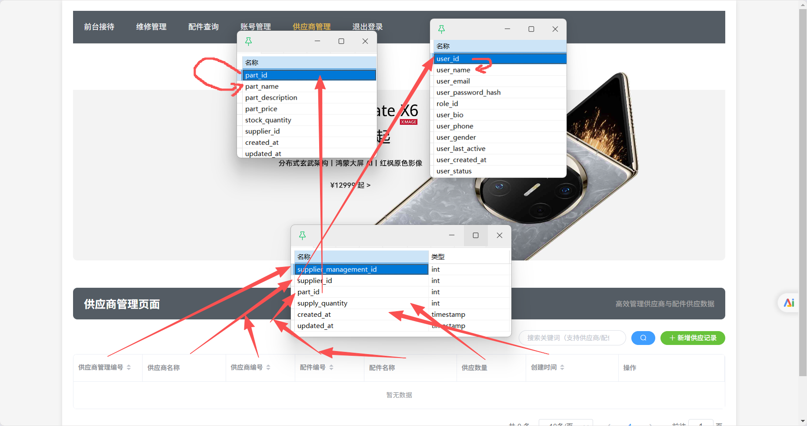

<h1>供应商管理模块</h1>

## 前端内容

### HTML文件

打开管理前端的idea窗口，在/page目录下创建supplier.html文件，将里面idea给你写的框架先删除，然后将下面的代码粘贴进去

```html
<!DOCTYPE html>
<html>
<head>
    <meta charset="UTF-8">
    <link rel="icon" href="/favicon.ico">
    <meta name="viewport" content="width=device-width, initial-scale=1.0">
    <title>KUAI 手机维修 - 供应商管理</title>
    <!-- 引入 ElementUI 样式 -->
    <link rel="stylesheet" href="/static/elementui/index.css">
    <!-- 引入 Vue 2 -->
    <script src="/static/vue2/vue.min.js"></script>
    <!-- 引入 ElementUI JS -->
    <script src="/static/elementui/index.js"></script>
    <!-- 引入 Axios -->
    <script src="/static/axios.min.js"></script>
    <!-- 引入自定义样式和公共样式 -->
    <link rel="stylesheet" href="/css/repairPage.css">
    <link rel="stylesheet" href="/css/common.css">
    <!-- 引入 Cookies操作第三方JS -->
    <script src="/static/js.cookie.min.js"></script>
</head>
<body>
<div id="app">
    <!-- 导航栏（与维修页面一致，默认选中“供应商管理”） -->
    <el-menu :default-active="activeIndex" class="el-menu-demo" mode="horizontal" background-color="#545c64"
             text-color="#fff" active-text-color="#ffd04b">
        <el-menu-item index="1-1" @click="goToIndex">前台接待</el-menu-item>
        <el-menu-item index="2-1" @click="goToRepair">维修管理</el-menu-item>
        <el-menu-item index="3-1" @click="goToAccess">配件查询</el-menu-item>
        <el-menu-item index="4-1" @click="goToUser">账号管理</el-menu-item>
        <el-menu-item index="5-1" @click="goToSupplier" class="is-active">供应商管理</el-menu-item>
        <el-menu-item index="6" @click="logout">退出登录</el-menu-item>
    </el-menu>

    <!-- 图片轮播 -->
    <el-carousel :interval="5000" arrow="" height="450px" style="width: 100%;height: 450px;">
        <el-carousel-item>
            
        </el-carousel-item>
        <el-carousel-item>
            
        </el-carousel-item>
        <el-carousel-item>
            
        </el-carousel-item>
        <el-carousel-item>
            
        </el-carousel-item>
    </el-carousel>

    <!-- 页面内容区 -->
    <div class="container">
        <!-- 模块标题（保持风格统一） -->
        <div class="hengfu">
            <span>供应商管理页面</span>
            <span style="font-size: 13px;font-weight: 500;color: rgb(164, 164, 164);">&emsp;高效管理供应商与配件供应数据</span>
        </div>

        <!-- 搜索栏 + 新增按钮 -->
        <template>
            <div class="searchInput" style="width: 380px;margin-bottom: 16px;">
                <el-input v-model="searchKeyword" placeholder="搜索关键词（支持供应商/配件编号）" clearable size="mini"
                          @input="updateSearch" @keyup.enter="filterTable"></el-input>
                <el-button class="minibutton" size="mini" type="primary" @click="filterTable"><i
                        class="el-icon-search"></i></el-button>
                <el-button class="minibutton" size="mini" type="success" @click="addSupplier">
                    <i class="el-icon-plus"></i> 新增供应记录
                </el-button>
            </div>
        </template>

        <!-- 供应商表格（展示指定字段） -->
        <el-table style="zoom: 85%" :data="tableData" style="width: 100%" border highlight-current-row
                  @sort-change="handleSortChange" :loading="loading">
            <el-table-column prop="supplierManagementId" label="供应商管理编号" width="150" sortable></el-table-column>
            <el-table-column prop="supplierName" label="供应商名称" width="180"></el-table-column>
            <el-table-column prop="supplierId" label="供应商编号" width="150" sortable></el-table-column>
            <el-table-column prop="partId" label="配件编号" width="150" sortable></el-table-column>
            <el-table-column prop="partName" label="配件名称" width="200"></el-table-column>
            <el-table-column prop="supplyQuantity" label="供应数量" width="150"></el-table-column>
            <el-table-column prop="createdAt" label="创建时间" width="200" sortable></el-table-column>
            <el-table-column label="操作" width="230">
                <template slot-scope="scope">
                    <el-button size="mini" type="info" @click="viewSupplierDetails(scope.row)">详情</el-button>
                    <el-button size="mini" type="primary" @click="updateSupplier(scope.row)">修改</el-button>
                    <el-button size="mini" type="danger" @click="deleteSupplier(scope.row)">删除</el-button>
                </template>
            </el-table-column>
        </el-table>

        <!-- 分页组件（与维修页面逻辑一致） -->
        <el-pagination @size-change="handleSizeChange" @current-change="handleCurrentChange" :current-page="pageNum"
                       :page-sizes="[10, 20, 30, 40]" :page-size="pageSize"
                       layout="total, sizes, prev, pager, next, jumper"
                       :total="count" style="margin-top: 16px;text-align: right;">
        </el-pagination>
    </div>

    <!-- 1. 新增供应商弹窗（填写4个指定字段） -->
    <el-dialog title="新增供应记录" :visible.sync="addSupplierDialog" width="420px">
        <el-form :model="newSupplier" label-width="130px" ref="addSupplierForm" :rules="addSupplierRules">
            <el-form-item label="供应商编号" prop="supplierId">
                <el-input v-model="newSupplier.supplierId" placeholder="请输入供应商编号"></el-input>
            </el-form-item>
            <el-form-item label="配件编号" prop="partId">
                <el-input v-model="newSupplier.partId" placeholder="请输入配件编号"></el-input>
            </el-form-item>
            <el-form-item label="供应数量" prop="supplyQuantity">
                <el-input type="number" min="1" v-model="newSupplier.supplyQuantity"
                          placeholder="请输入供应数量（≥1）"></el-input>
            </el-form-item>
        </el-form>
        <div slot="footer" class="dialog-footer">
            <el-button @click="addSupplierDialog = false">取消</el-button>
            <el-button type="primary" @click="submitNewSupplier">提交</el-button>
        </div>
    </el-dialog>

    <!-- 2. 修改供应商弹窗（复用新增字段，默认填充当前数据） -->
    <el-dialog title="修改供应记录" :visible.sync="updateSupplierDialog" width="420px">
        <el-form :model="currentSupplier" label-width="130px" ref="updateSupplierForm" :rules="updateSupplierRules">
            <el-form-item label="供应商管理编号" prop="supplierManagementId">
                <el-input v-model="currentSupplier.supplierManagementId" disabled
                          placeholder="管理编号不可修改"></el-input>
            </el-form-item>
            <el-form-item label="供应商编号" prop="supplierId">
                <el-input v-model="currentSupplier.supplierId" placeholder="请输入供应商编号"></el-input>
            </el-form-item>
            <el-form-item label="配件编号" prop="partId">
                <el-input v-model="currentSupplier.partId" placeholder="请输入配件编号"></el-input>
            </el-form-item>
            <el-form-item label="供应数量" prop="supplyQuantity">
                <el-input type="number" min="1" v-model="currentSupplier.supplyQuantity"
                          placeholder="请输入供应数量（≥1）"></el-input>
            </el-form-item>
        </el-form>
        <div slot="footer" class="dialog-footer">
            <el-button @click="updateSupplierDialog = false">取消</el-button>
            <el-button type="primary" @click="submitUpdatedSupplier">保存</el-button>
        </div>
    </el-dialog>
</div>

<!-- 引入页面逻辑JS -->
<script src="/js/supplier.js"></script>
</body>
</html>
```

### JS文件

观察上面html文件的末尾，引入了页面逻辑JS，但是我们项目里并没有这个文件，那么我们现在就创建这个文件，在/js目录下创建supplier.js文件，并将我下面的代码粘贴进去：

```javascript
new Vue({
  el: '#app',
  data() {
    return {
      activeIndex: '5-1',
      searchKeyword: '',
      tableData: [],
      loading: false,
      userId: 1,
      userRole: 1,
      pageNum: 1,
      pageSize: 10,
      sortField: 'created_at',
      sortOrder: 'desc',
      count: 0,

      // 新增弹窗相关
      addSupplierDialog: false,
      // 移除 supplierManagementId 字段，因为它是自增的
      newSupplier: {
        supplierId: '',
        partId: '',
        supplyQuantity: null
      },
      // 移除 supplierManagementId 的验证规则
      addSupplierRules: {
        supplierId: [
          { required: true, message: '请输入供应商编号', trigger: 'blur' }
        ],
        partId: [
          { required: true, message: '请输入配件编号', trigger: 'blur' }
        ],
        supplyQuantity: [
          { required: true, message: '请输入供应数量', trigger: 'blur' },
          {
            validator: (rule, value, callback) => {
              if (value === '' || value === null) {
                callback(new Error('请输入供应数量'));
              } else if (Number(value) <= 0 || !Number.isInteger(Number(value))) {
                callback(new Error('供应数量需为正整数'));
              } else {
                callback();
              }
            },
            trigger: 'blur'
          }
        ]
      },

      // 修改弹窗相关
      updateSupplierDialog: false,
      currentSupplier: {},
      updateSupplierRules: {
        supplierId: [
          { required: true, message: '请输入供应商编号', trigger: 'blur' }
        ],
        partId: [
          { required: true, message: '请输入配件编号', trigger: 'blur' }
        ],
        supplyQuantity: [
          { required: true, message: '请输入供应数量', trigger: 'blur' },
          {
            validator: (rule, value, callback) => {
              if (value === '' || value === null) {
                callback(new Error('请输入供应数量'));
              } else if (Number(value) <= 0 || !Number.isInteger(Number(value))) {
                callback(new Error('供应数量需为正整数'));
              } else {
                callback();
              }
            },
            trigger: 'blur'
          }
        ]
      }
    };
  },
  created() {
    this.getUserInfoFromCookie();
    this.fetchTableData();
  },
  methods: {
    getUserInfoFromCookie() {
      const userInfoEncoded = Cookies.get('userInfo');
      if (userInfoEncoded) {
        const userInfo = JSON.parse(decodeURIComponent(userInfoEncoded));
        this.userId = userInfo.userId || 1;
        this.userRole = userInfo.userRole || 1;
      } else {
        this.$alert('未检测到登录状态，将跳转至登录页', '登录失效', {
          confirmButtonText: '确定',
          callback: () => window.location.href = '/page/login.html'
        });
      }
    },

    updateSearch(value) {
      this.searchKeyword = value;
    },
    filterTable() {
      this.pageNum = 1;
      this.fetchTableData();
    },

    fetchTableData() {
      this.loading = true;
      axios.get(`http://127.0.0.1:8081/supplier/getAllSupplierManagement`, {
        params: {
          searchKeyword: this.searchKeyword,
          pageNum: this.pageNum,
          pageSize: this.pageSize,
          sortField: this.sortField,
          sortOrder: this.sortOrder
        }
      })
          .then(response => {
            if (response.data.code === 200) {
              const resData = response.data.data || {};
              if (!resData.supplierManagementList) {
                this.$message.error('数据格式错误，请联系开发人员');
                return;
              }
              this.tableData = resData.supplierManagementList.map(item => ({
                supplierManagementId: item.supplierManagementId || '',
                supplierName: item.supplierName || '',
                supplierId: item.supplierId || '',
                partId: item.partId || '',
                partName: item.partName || '',
                supplyQuantity: item.supplyQuantity || 0,
                createdAt: item.createdAt || ''
              }));
              this.count = resData.count || 0;
            } else {
              this.$message.error(`获取数据失败：${response.data.msg || '未知错误'}`);
            }
          })
          .catch(() => {
            this.$message.error('获取数据失败，请稍后再试');
          })
          .finally(() => {
            this.loading = false;
          });
    },

    viewSupplierDetails(supplier) {
      this.$alert(
          `<h3>供应记录详情</h3>
        <p>供应商管理编号：${supplier.supplierManagementId}</p>
        <p>供应商名称：${supplier.supplierName}</p>
        <p>供应商编号：${supplier.supplierId}</p>
        <p>配件编号：${supplier.partId}</p>
        <p>配件名称：${supplier.partName}</p>
        <p>供应数量：${supplier.supplyQuantity}</p>
        <p>创建时间：${supplier.createdAt}</p>`,
          '详情',
          {
            dangerouslyUseHTMLString: true,
            confirmButtonText: '确定',
            width: '400px'
          }
      );
    },

    addSupplier() {
      this.$refs.addSupplierForm && this.$refs.addSupplierForm.resetFields();
      // 只需要初始化可填写的字段
      this.newSupplier = {
        supplierId: '',
        partId: '',
        supplyQuantity: null
      };
      this.addSupplierDialog = true;
    },
    submitNewSupplier() {
      this.$refs.addSupplierForm.validate((isValid) => {
        if (isValid) {
          const dataToSubmit = {
            ...this.newSupplier,
            supplyQuantity: Number(this.newSupplier.supplyQuantity)
          };
          axios.post(`http://127.0.0.1:8081/supplier/createSupplierManagement`, dataToSubmit)
              .then(response => {
                if (response.data.code === 200) {
                  this.$message.success('新增供应记录成功！');
                  this.addSupplierDialog = false;
                  this.fetchTableData();
                } else {
                  this.$message.error(`新增失败：${response.data.msg || '未知错误'}`);
                }
              })
              .catch(() => {
                this.$message.error('新增失败，请稍后再试');
              });
        }
      });
    },

    updateSupplier(supplier) {
      this.currentSupplier = {
        ...supplier,
        // 确保供应数量是数字类型
        supplyQuantity: Number(supplier.supplyQuantity)
      };
      this.updateSupplierDialog = true;
    },
    submitUpdatedSupplier() {
      this.$refs.updateSupplierForm.validate((isValid) => {
        if (isValid) {
          const dataToSubmit = {
            ...this.currentSupplier,
            supplyQuantity: Number(this.currentSupplier.supplyQuantity)
          };
          axios.post(`http://127.0.0.1:8081/supplier/updateSupplierManagement`, dataToSubmit)
              .then(response => {
                if (response.data.code === 200) {
                  this.$message.success('修改供应记录成功！');
                  this.updateSupplierDialog = false;
                  this.fetchTableData();
                } else {
                  this.$message.error(`修改失败：${response.data.msg || '未知错误'}`);
                }
              })
              .catch(() => {
                this.$message.error('修改失败，请稍后再试');
              });
        }
      });
    },

    deleteSupplier(supplier) {
      if (!supplier.supplierManagementId) {
        this.$message.error('供应记录ID缺失，无法删除');
        return;
      }

      this.$prompt('请输入密码确认删除', '删除确认', {
        inputType: 'password',
        confirmButtonText: '确定',
        cancelButtonText: '取消',
        inputPlaceholder: '输入当前用户密码'
      })
          .then(({ value: userPasswd }) => {
            if (!userPasswd.trim()) {
              this.$message.error('密码不能为空');
              return;
            }

            axios.post(
                `http://127.0.0.1:8081/supplier/deleteSupplierManagement`,
                null,
                {
                  params: {
                    supplierManagementId: supplier.supplierManagementId,
                    userId: this.userId,
                    userPasswd: userPasswd
                  }
                }
            )
                .then(response => {
                  if (response.data.code === 200) {
                    this.$message.success('删除供应记录成功！');
                    this.fetchTableData();
                  } else {
                    this.$message.error(`删除失败：${response.data.msg || '密码错误或无权限'}`);
                  }
                })
                .catch(() => {
                  this.$message.error('删除失败，请稍后再试');
                });
          })
          .catch(() => {
            this.$message.info('已取消删除操作');
          });
    },

    handleSortChange({ prop, order }) {
      this.sortField = prop === 'supplierManagementId' ? 'supplier_management_id' :
          prop === 'supplierId' ? 'supplier_id' :
              prop === 'partId' ? 'part_id' :
                  'created_at';
      this.sortOrder = order === 'ascending' ? 'asc' : 'desc';
      this.fetchTableData();
    },
    handleSizeChange(val) {
      this.pageSize = val;
      this.fetchTableData();
    },
    handleCurrentChange(val) {
      this.pageNum = val;
      this.fetchTableData();
    },

    goToPage(pageName) {
      window.location.href = `/${pageName}.html`;
    },
    goToIndex() { this.goToPage('index'); },
    goToRepair() { this.goToPage('page/repair'); },
    goToAccess() { this.goToPage('page/access'); },
    goToUser() { this.goToPage('page/user'); },
    goToSupplier() { this.goToPage('page/supplier'); },

    logout() {
      this.$confirm('确定要退出登录吗？', '退出确认', {
        confirmButtonText: '确定',
        cancelButtonText: '取消',
        type: 'warning'
      })
          .then(() => {
            Cookies.remove('userInfo');
            this.goToPage('page/login');
          })
          .catch(() => {
            this.$message.info('已取消退出操作');
          });
    }
  }
});
```

粘贴完不要着急，我们还需要修改一部分内容，我们注意观察代码第107行的内容，有一个请求地址，它的作用就是告诉前端向后端请求的地址，我们要在8081/的后面添加一个“/yjx”，使那一行的内容最后修改成（axios.get(`http://127.0.0.1:8081/supplier/getAllSupplierManagement`, {）括号内的模样。那么相对于的还有代码第181，213,249三处地方

## 后端

那我们回头观察我们的js文件，要观察它向后台请求了哪些接口，只有知道了前端向我们请求了哪些接口我们后端才能更精确的完成所需要完成的功能。

| HTTP 方法 | API 接口                           | 描述                           | 传递的参数（params 或 data）                                 |
| --------- | ---------------------------------- | ------------------------------ | ------------------------------------------------------------ |
| GET       | /supplier/getAllSupplierManagement | 获取所有供应商管理记录的列表。 | 查询参数 (params):<br>- searchKeyword: 搜索关键词（可选）<br>- pageNum: 当前页码<br>- pageSize: 每页记录数<br>- sortField: 排序字段（例如 created_at）<br>- sortOrder: 排序顺序 (asc 或 desc) |
| POST      | /supplier/createSupplierManagement | 创建一个新的供应商管理记录。   | 请求体 (data):<br>- supplierId: 供应商编号<br>- partId: 配件编号<br>- supplyQuantity: 供应数量 |
| POST      | /supplier/updateSupplierManagement | 更新一个已有的供应商管理记录。 | 请求体 (data):<br>- supplierManagementId: 供应商管理记录ID<br>- supplierId: 供应商编号<br>- partId: 配件编号<br>- supplyQuantity: 供应数量 |
| POST      | /supplier/deleteSupplierManagement | 删除一个供应商管理记录。       | 查询参数 (params):<br>- supplierManagementId: 要删除的供应商管理记录ID<br>- userId: 当前登录用户的ID<br>- userPasswd: 当前登录用户的密码 |

这里我们将请求的内容已经传递的参数整理出来，让大家能够更直观的感受到后端需要完成的接口，接下来就可以开始代码的编写了。

### Pojo层

要开始一个模块的编写，首先第一步无疑是创建对应的实体类。我们打开数据库观察我们的表结构



根据我们的表结构就可以编写我们的实体类

在/pojo目录下创建一个Supplier.java类，根据表结构中的字段编写实体类当中的属性

```java
package com.yjx.pojo;

import com.baomidou.mybatisplus.annotation.TableName;
import lombok.AllArgsConstructor;
import lombok.Builder;
import lombok.Data;
import lombok.NoArgsConstructor;

import java.time.LocalDateTime;

@Data
@NoArgsConstructor
@AllArgsConstructor
@Builder
@TableName("yjx_supplier_management")
public class Supplier {
    private Integer supplierManagementId;
    private Integer supplierId;
    private Integer partId;
    private Integer supplyQuantity;
    private LocalDateTime createdAt;
    private LocalDateTime updatedAt;
    // 以下为关联表字段（非数据库表字段，用于前端展示）
    @TableField(exist = false)
    private String supplierName; // 来自 yjx_user 表的供应商名称
    @TableField(exist = false)
    private String partName;     // 来自 yjx_parts 表的配件名称
}
```

### 查询操作

#### Controller层

```Java
package com.yjx.controller;

import com.yjx.pojo.Supplier;
import com.yjx.service.SupplierService;
import com.yjx.util.Result;
import org.springframework.beans.factory.annotation.Autowired;
import org.springframework.web.bind.annotation.*;
import java.util.Map;

@RestController
@RequestMapping("/supplier")
public class SupplierController {

	@Autowired
    private SupplierService supplierService;
    
    /**
     * GET /supplier/getAllSupplierManagement
     * 分页获取所有供应商管理记录
     */
    @GetMapping("/getAllSupplierManagement")
    public Result<Map<String, Object>> getAllSupplierManagement(
            @RequestParam(required = false) String searchKeyword,
            @RequestParam(defaultValue = "1") Integer pageNum,
            @RequestParam(defaultValue = "10") Integer pageSize,
            @RequestParam(defaultValue = "created_at") String sortField,
            @RequestParam(defaultValue = "desc") String sortOrder) {
        try {
            // 参数合法性校验，排序字段限制
            if (!"supplier_management_id".equals(sortField) && !"supplier_id".equals(sortField) &&
                    !"part_id".equals(sortField) && !"created_at".equals(sortField)) {
                return Result.fail("非法的排序字段", 400);
            }

            Map<String, Object> result = supplierService.getAllSupplierManagement(
                    searchKeyword,
                    pageNum,
                    pageSize,
                    sortField,
                    sortOrder
            );
            // 使用你的 success 方法，并传入 data
            return Result.success(result);
        } catch (Exception e) {
            return Result.fail("服务器异常，获取数据失败", 500);
        }
    }
}
```

#### Service层

```Java
/**
     * 分页查询所有供应商管理记录
     * @param searchKeyword 搜索关键词
     * @param pageNum 当前页码
     * @param pageSize 每页记录数
     * @param sortField 排序字段
     * @param sortOrder 排序方向
     * @return 分页结果，包含总记录数和数据列表
     */
    Map<String, Object> getAllSupplierManagement(String searchKeyword, Integer pageNum, Integer pageSize, String sortField, String sortOrder);
```

#### Sercice实现层

```Java
package com.yjx.service.impl;

import com.baomidou.mybatisplus.core.metadata.IPage;
import com.baomidou.mybatisplus.extension.plugins.pagination.Page;
import com.yjx.mapper.SupplierMapper;
import com.yjx.mapper.UserMapper;
import com.yjx.pojo.Supplier;
import com.yjx.service.SupplierService;
import com.yjx.util.Md5Password;
import org.springframework.beans.factory.annotation.Autowired;
import org.springframework.stereotype.Service;
import java.time.LocalDateTime;
import java.util.HashMap;
import java.util.Map;

@Service
public class SupplierServiceImpl implements SupplierService {
    @Autowired
    private SupplierMapper supplierMapper;
    @Autowired
    private UserMapper userMapper;
    
    /**
     * 分页查询供应商管理记录
     */
    @Override
    public Map<String, Object> getAllSupplierManagement(String searchKeyword, Integer pageNum, Integer pageSize, String sortField, String sortOrder) {
        // 1. 参数校验与默认值设置（避免null异常）
        pageNum = (pageNum == null || pageNum < 1) ? 1 : pageNum;
        pageSize = (pageSize == null || pageSize < 1) ? 10 : pageSize;
        searchKeyword = (searchKeyword == null) ? "" : searchKeyword.trim();
        // 默认排序：按创建时间降序
        if (sortField == null || sortField.trim().isEmpty()) {
            sortField = "createdAt";
        }
        if (sortOrder == null || (!"asc".equalsIgnoreCase(sortOrder) && !"desc".equalsIgnoreCase(sortOrder))) {
            sortOrder = "desc";
        }
        Page<Supplier> page = new Page<>(pageNum, pageSize);
        IPage<Supplier> supplierIPage = supplierMapper.selectSupplierByCondition(
                page,
                searchKeyword,
                sortField,
                sortOrder
        );
        Map<String, Object> result = new HashMap<>();
        result.put("supplierManagementList", supplierIPage.getRecords());
        result.put("count", supplierIPage.getTotal());
        return result;
    }
}
```

#### Mapper层

```Java
package com.yjx.mapper;

import com.baomidou.mybatisplus.core.mapper.BaseMapper;
import com.baomidou.mybatisplus.core.metadata.IPage;
import com.baomidou.mybatisplus.extension.plugins.pagination.Page;
import com.yjx.pojo.Supplier;
import org.apache.ibatis.annotations.Delete;
import org.apache.ibatis.annotations.Insert;
import org.apache.ibatis.annotations.Param;
import org.apache.ibatis.annotations.Select;
import org.apache.ibatis.annotations.Update;

public interface SupplierMapper extends BaseMapper<Supplier> {
    /**
     * 分页查询供应商管理记录：支持搜索、排序
     * @param page 分页参数（页码、每页条数）
     * @param searchKeyword 搜索关键词（模糊查供应商编号、配件编号）
     * @param sortField 排序字段
     * @param sortOrder 排序方向（asc/desc）
     * @return 分页结果
     */
    @Select("""
    SELECT 
        sm.*, -- 供应商管理表所有字段
        u.user_name AS supplierName, -- 从用户表获取供应商名称
        p.part_name AS partName -- 从配件表获取配件名称
    FROM yjx_supplier_management sm
    -- 关键：通过sm.supplier_id关联到用户表，并过滤出角色为供应商（role_id=5）的用户
    LEFT JOIN yjx_user u ON sm.supplier_id = u.user_id AND u.role_id = 5
    -- 关键：通过sm.part_id关联到配件表
    LEFT JOIN yjx_parts p ON sm.part_id = p.part_id
    WHERE 1=1
    -- 搜索关键词：模糊匹配供应商编号或配件编号
    AND ( CAST(sm.supplier_id AS CHAR) LIKE CONCAT('%', #{searchKeyword}, '%')
          OR CAST(sm.part_id AS CHAR) LIKE CONCAT('%', #{searchKeyword}, '%') )
    -- 排序：按指定字段排序，若无则默认按创建时间降序
    ORDER BY 
        CASE WHEN #{sortField} IS NOT NULL AND #{sortOrder} IS NOT NULL 
             THEN CASE #{sortField}
                  WHEN 'supplier_management_id' THEN sm.supplier_management_id
                  WHEN 'supplier_id' THEN sm.supplier_id
                  WHEN 'part_id' THEN sm.part_id
                  WHEN 'created_at' THEN sm.created_at
                  ELSE sm.created_at END 
        ELSE sm.created_at END 
        ${sortOrder == 'desc' ? 'DESC' : 'ASC'}
    """)
    IPage<Supplier> selectSupplierByCondition(
            Page<Supplier> page,
            @Param("searchKeyword") String searchKeyword,
            @Param("sortField") String sortField,
            @Param("sortOrder") String sortOrder
    );
}
```


### 添加操作

#### Controller层

```Java
/**
     * POST /supplier/createSupplierManagement
     * 新增供应商管理记录
     */
    @PostMapping("/createSupplierManagement")
    public Result<Void> createSupplierManagement(@RequestBody Supplier supplier) {

        return supplierService.createSupplierManagement(supplier);

    }
```

#### Service层

```Java
/**
     * 创建新的供应商管理记录
     * @param supplier 供应商记录数据
     * @return 是否成功
     */
    Result<Void> createSupplierManagement(Supplier supplier);
```

#### Service实现层

```Java
@Override
    public Result<Void> createSupplierManagement(Supplier supplier) {
        //参数校验
        if(supplier.getSupplyQuantity()<0){
            return Result.fail("数量不能小于0",400);
        }
        if(supplier.getPartId() ==  null){
            return Result.fail("配件编号不能为空",400);
        }
        User user = userMapper.selectById(supplier.getSupplierId());
        if(user.getRoleId() != 5){
            return Result.fail("该角色不是供应商",400);
        }
        // 核心修改：将 supplierManagementId 设为 null，让数据库自增
        supplier.setSupplierManagementId(null);
        // 设置创建和更新时间
        supplier.setCreatedAt(LocalDateTime.now());
        supplier.setUpdatedAt(LocalDateTime.now());
        // 插入数据库，MyBatis-Plus 会自动处理自增主键
        if(supplierMapper.insert(supplier) > 0){
            return Result.success(null);
        }
        return Result.fail("添加失败",500);
    }
```

#### Mapper层

```Java
/**
 * 插入新的供应商管理记录
 * @param supplier 供应商记录
 * @return 影响的行数
 */
@Insert("""
INSERT INTO yjx_supplier_management (
     supplier_id, part_id, supply_quantity, created_at, updated_at
) VALUES (
     #{supplierId}, #{partId}, #{supplyQuantity}, #{createdAt}, #{updatedAt}
)
""")
int insert(Supplier supplier);
```

### 更新操作

#### Controller层

```Java
/**
     * POST /supplier/updateSupplierManagement
     * 修改供应商管理记录
     */
    @PostMapping("/updateSupplierManagement")
    public Result<Void> updateSupplierManagement(@RequestBody Supplier supplier) {
        return supplierService.updateSupplierManagement(supplier);
    }
```

#### Service层

```Java
/**
     * 更新供应商管理记录
     * @param supplier 供应商记录数据
     * @return 是否成功
     */
    Result<Void> updateSupplierManagement(Supplier supplier);
```

#### Service实现层

```Java
/**
     * 更新供应商管理记录
     */
    @Override
    public Result<Void> updateSupplierManagement(Supplier supplier) {
        //参数校验
        if(supplier.getSupplyQuantity()<0){
            return Result.fail("数量不能小于0",400);
        }
        if(supplier.getPartId() ==  null){
            return Result.fail("配件编号不能为空",400);
        }
        User user = userMapper.selectById(supplier.getSupplierId());
        if(user.getRoleId() != 5){
            return Result.fail("该角色不是供应商",400);
        }
        supplier.setUpdatedAt(LocalDateTime.now());
        if(supplierMapper.updateById(supplier) > 0){
            return Result.success(null);
        }
        return Result.fail("更新失败",500);
    }
```

#### Mapper层

```Java
/**
 * 更新供应商管理记录
 * @param supplier 供应商记录
 * @return 影响的行数
 */
@Update("""
UPDATE yjx_supplier_management
SET
    supplier_id = #{supplierId},
    part_id = #{partId},
    supply_quantity = #{supplyQuantity},
    updated_at = #{updatedAt}
WHERE supplier_management_id = #{supplierManagementId}
""")
int updateById(Supplier supplier);
```

### 删除操作

#### Controller层

```Java
/**
     * POST /supplier/deleteSupplierManagement
     * 删除供应商管理记录，需要密码校验
     */
    @PostMapping("/deleteSupplierManagement")
    public Result<Void> deleteSupplierManagement(@RequestParam Integer supplierManagementId,
                                                 @RequestParam Integer userId,
                                                 @RequestParam String userPasswd) {
        return supplierService.deleteSupplierManagement(supplierManagementId, userId, userPasswd);
    }
```

#### Service层

```Java
 /**
     * 删除供应商管理记录
     * @param supplierManagementId 供应商管理记录ID
     * @param userId 用户ID
     * @param userPasswd 用户密码
     * @return 是否成功
     */
    Result<Void> deleteSupplierManagement(Integer supplierManagementId, Integer userId, String userPasswd);
```

#### Service实现层

```Java
/**
     * 删除供应商管理记录，需进行密码校验
     */
    @Override
    public Result<Void> deleteSupplierManagement(Integer supplierManagementId, Integer userId, String userPasswd) {
        if (userId == null) {
            return Result.fail("用户编号不能为空", 400);
        }
        if (userPasswd == null) {
            return Result.fail("用户密码不能为空", 400);
        }
        User user = userMapper.selectById(userId);
        String password = Md5Password.generateMD5(userPasswd);
        if (!user.getUserPasswordHash().equals(password)) {
            return Result.fail("密码错误", 400);
        }
        if (supplierMapper.deleteByManagementId(supplierManagementId) > 0) {
            return Result.success(null);
        } else {
            return Result.fail("删除失败", 500);
        }
    }
```

#### Mapper层

```Java
/**
 * 根据 ID 删除供应商管理记录
 * @param supplierManagementId 供应商管理编号
 * @return 影响的行数
 */
@Delete("DELETE FROM yjx_supplier_management WHERE supplier_management_id = #{supplierManagementId}")
int deleteByManagementId(@Param("supplierManagementId") Integer supplierManagementId);
```
